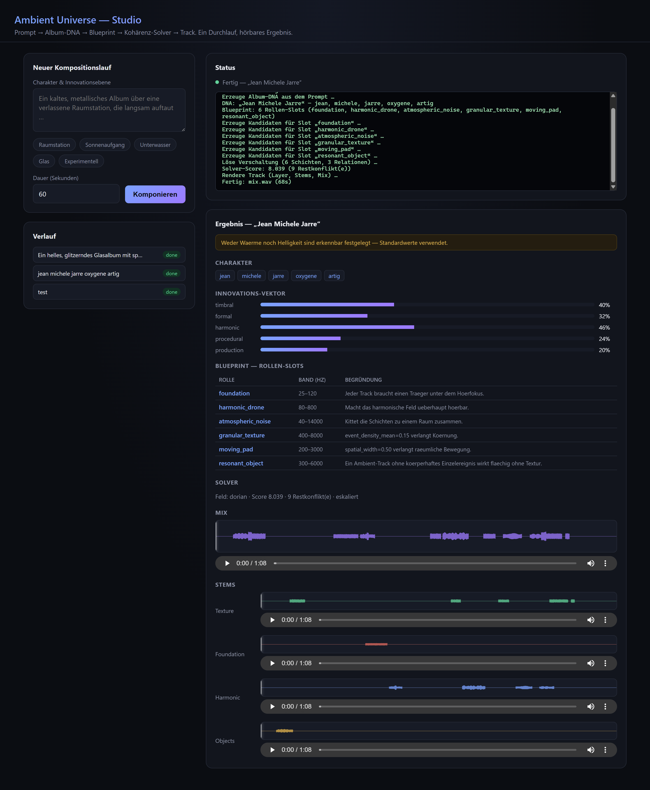

# Ambient Universe (AU)

KI-gestützte Ambient-Kompositionsmaschine aus flexibel verschaltbaren Funktionsmodulen,
orchestriert von einem **Master-Integrator über 10 hierarchische Organisationslevel** —
von der Klangerzeugung auf Sampleebene bis zum fertigen, gemasterten Album.

> Architektur, Organisationsdefinitionen und Stufenplan: **[plan.md](plan.md)**



## Der Kompositionsworkflow

1. **Prompt** — eine KI definiert ganzheitlich Charakter und Innovationsebene des Albums (`au dna`)
2. **Blueprint** — der Master-Integrator leitet daraus die Verschaltungshierarchie ab (`au blueprint`)
3. **Vorschlag** — die Maschine schlägt fertige Klangelemente zum Vorhören vor (`au propose`)
4. **Modulation** — per natürlicher Sprache verändern und erneut hören (`au modulate`)
5. **Ablage** — zufriedenstellende Elemente einfrieren (`au freeze` → `elements/`)
6. **Orchestrierung** — sequenziell und parallel rekombinieren, mit expliziten Bezügen
   zwischen den Elementen (`au arrange` → `au render` → `au album`)

## Schnellstart

```bash
uv venv --python 3.12
uv pip install -e ".[dev,audio]"
au doctor
```

`au doctor` prüft Python, Pakete, `scsynth`, `ffmpeg` und die Arbeitsverzeichnisse und nennt
für jeden Befund die konkrete Abhilfe.

Weitere Befehle, die heute schon laufen:

```bash
au probe --kind stack --duration 60 --repeat 3   # NRT-Render, Leistung, Determinismus
au modules --level 2                             # Modulkatalog
au modules --show gen.object.modal_bell          # Modul im Detail
au compose "Ein kaltes, metallisches Album …" -d 60   # Prompt -> hörbarer Track (CLI)
au serve                                              # Web-Studio unter http://127.0.0.1:8000
```

### Web-Studio

`au serve` startet eine lokale Weboberfläche (FastAPI + Vanilla-JS, kein Build-Schritt):
Prompt eingeben → Fortschritt live verfolgen → Album-DNA, Blueprint-Rollen-Slots und
Solver-Status einsehen → Mix und Stems mit echter Waveform-Anzeige (Web-Audio-API,
Klick-zum-Springen, Abspielkopf) direkt im Browser anhören. Erfordert das `studio`-Extra:

```bash
uv pip install -e ".[studio]"
au serve --port 8000
```

### Voraussetzungen

| Werkzeug | Zweck | Installation (Windows) |
|----------|-------|------------------------|
| Python ≥ 3.12 | Kern | — |
| SuperCollider ≥ 3.13 | Audio-Backend (NRT-Rendering) | `winget install --id SuperCollider.SuperCollider` |
| ffmpeg | Export (ab Phase 10) | `winget install --id Gyan.FFmpeg` |

SuperCollider steht unter GPL-3.0 und läuft bewusst als **eigener Prozess** — der Python-Kern
spricht ausschließlich über NRT-Score-Dateien und OSC mit ihm.

## Projektstruktur

```
au/            Python-Kern (core, dsl, modules, integrator, arrange, render, analysis, library)
knowledge/     Ausführbare Ambient-Wissensbasis (DSP-, Kompositions-, Produktionsregeln)
elements/      Die Elementbibliothek — eingefrorene, wiederverwendbare Klangelemente
projects/      Alben (dna, blueprint, arrangement, renders, master)
synthdefs/     SynthDef-Cache
tests/         Tests inkl. Grammatik-, Determinismus- und Klangregressionstests
```

## Stand der Umsetzung

| Phase | Inhalt | Status |
|-------|--------|--------|
| 0 | Fundament, Konfiguration, `au doctor`, NRT-Render | **fertig** |
| 1 | Modulkontrakt, Porttypen, PatchGraph, Registry, 15 Manifeste | **fertig** |
| 2 | L1–L3: SynthDef-Compiler, Klangatom, Stimme, Geste | **fertig** |
| 3 | L4: Klangelement, Vorhör-Renderer, MIDI-Export | **fertig** |
| 4 | Album-DNA-Agent, Negativregeln, Innovations-Vektor | **fertig** |
| 5 | Blueprint-Generator (DNA → Rollen-Slots) | **fertig** |
| 6 | Vorschlags-Engine, Editor-Agent | **fertig** |
| 7 | Elementbibliothek (Freeze, SQLite-Index) | **fertig** |
| 8 | L5/L6: Relations-Algebra, Kohärenz-Solver | **fertig** |
| 9 | L7/L8: Sektionen, Trackrendering, Bogenform | **fertig** |
| 10 | Album, Mastering, Reproduktionstest | als Nächstes |
| 11–13 | Kritik/Reparatur, DAW-Brücke, Härtung | offen |

**Wichtiger Vorbehalt:** Phasen 4 und 6 sehen laut `plan.md` einen echten LLM-Dialog
(DNA-Agent, Editor-Agent) vor. Diese Codebasis hat zur Laufzeit keinen LLM-Zugriff;
implementiert ist ein regelbasierter Stichwort-Übersetzer mit klar dokumentierter
Austauschstelle (`generate_dna()`, `apply_instruction()`), der dieselben Typen liefert.
Phase 8/9 nutzen eine strukturelle Band/Zeit-Konfliktfunktion statt der vollen
spektralen Maskierungskarte — siehe Commit-Nachrichten für Details je Phase.

## Lizenz

Proprietär. Abhängigkeiten und deren Auflagen: siehe [plan.md § 18](plan.md#18-lizenzmatrix).
