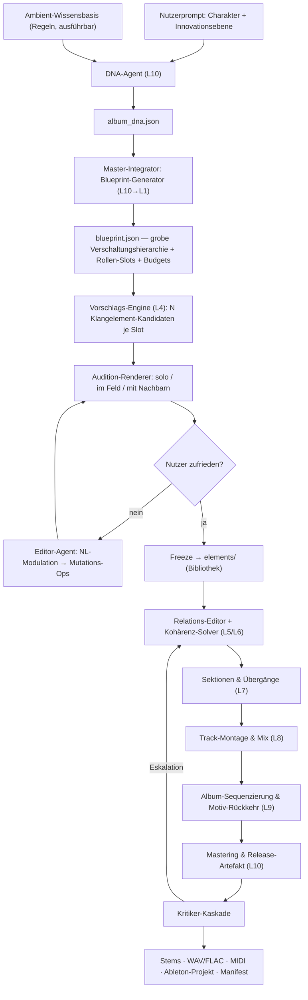

# AMBIENT UNIVERSE (AU) — Implementierungsplan

**Eine KI-gestützte Ambient-Kompositionsmaschine aus flexibel verschaltbaren Funktionsmodulen,
orchestriert von einem Master-Integrator über 10 hierarchische Organisationslevel.**

Stand: 26. Juli 2026
Grundlage: `Ambient KI Musikmaschine Repositories.md`, `Musikmaschine .md`
Dokumentstatus: Architektur- und Umsetzungsplan (verbindlich für Phase 0–13)

---

## Inhaltsverzeichnis

1. [Zielbild & Leitprinzipien](#1-zielbild--leitprinzipien)
2. [Gesamtarchitektur](#2-gesamtarchitektur)
3. [Der 10-Level-Organisationsraster (Übersicht)](#3-der-10-level-organisationsraster-übersicht)
4. [Master-Integrator: Organisationsdefinitionen L1–L10](#4-master-integrator-organisationsdefinitionen-l1l10)
5. [Modulsystem: Kontrakt, Porttypen, Registry](#5-modulsystem-kontrakt-porttypen-registry)
6. [Modulkatalog](#6-modulkatalog)
7. [Verschaltungsgrammatik, Relations-Algebra & Kohärenz-Solver](#7-verschaltungsgrammatik-relations-algebra--kohärenz-solver)
8. [Ambient-DSL & Datenmodelle](#8-ambient-dsl--datenmodelle)
9. [Der Kompositionsworkflow (Nutzersicht)](#9-der-kompositionsworkflow-nutzersicht)
10. [Element-Bibliothek (die Ablage)](#10-element-bibliothek-die-ablage)
11. [Der Innovations-Vektor, operationalisiert](#11-der-innovations-vektor-operationalisiert)
12. [Qualitätssystem, Kritiker & Gates](#12-qualitätssystem-kritiker--gates)
13. [Determinismus, Seeds, Reproduzierbarkeit](#13-determinismus-seeds-reproduzierbarkeit)
14. [Tech-Stack & Repo-Layout](#14-tech-stack--repo-layout)
15. [Stufenplan: Phase 0–13](#15-stufenplan-phase-013)
16. [Meilensteine & Abhängigkeiten](#16-meilensteine--abhängigkeiten)
17. [Risiken & Gegenmaßnahmen](#17-risiken--gegenmaßnahmen)
18. [Lizenzmatrix](#18-lizenzmatrix)
19. [Offene Entscheidungen](#19-offene-entscheidungen)
20. [Glossar](#20-glossar)

---

## 1. Zielbild & Leitprinzipien

### 1.1 Was gebaut wird

Eine Maschine, die aus einem einzigen ganzheitlichen Prompt („Charakter + Innovationsebene des
Albums") ein vollständiges, in sich kohärentes Ambient-Album erzeugt — aber **nicht als Blackbox**.
Der Nutzer bleibt an einer entscheidenden Stelle im Ring: Er bekommt einzelne, fertig klingende
**Klangelemente** zum Vorhören vorgeschlagen, moduliert sie per KI-Dialog, hört erneut, und legt
die zufriedenstellenden Elemente in einer Bibliothek ab. Die Maschine rekombiniert diese Elemente
anschließend sequenziell und parallel zu Sektionen, Tracks und Album — mit expliziten,
maschinell geprüften **Bezugnahmen** zwischen den Elementen, sodass das Zusammenspiel harmonisch
und angenehm bleibt.

### 1.2 Die neun Leitprinzipien

| # | Prinzip | Konsequenz im Bau |
|---|---------|-------------------|
| P1 | **Kontrakte statt Konventionen** | Jede Ebene und jedes Modul hat ein typisiertes, validierbares Ein-/Ausgabeschema (Pydantic + JSON-Schema). Kein „impliziter" Datenfluss. |
| P2 | **Die KI plant, sie führt nicht aus** | Ein LLM erzeugt niemals ausführbaren DSP-Code, der ungeprüft in den Audiothread geht. Es erzeugt *validierte Pläne* über einem geschlossenen Vokabular. |
| P3 | **Rezept statt Rendering** | Ein Klangelement wird als *parametrisches, feldrelatives Rezept* gespeichert, nicht als fixierte Audiodatei. Nur so ist es später transponierbar, umstimmbar, in Dichte skalierbar — also rekombinierbar. |
| P4 | **Relationen sind erstklassige Objekte** | „B antwortet auf A", „C weicht dem Band von A aus" ist eine gespeicherte, lösbare Constraint — kein Nebeneffekt des Mixings. |
| P5 | **Determinismus per Seed-Hierarchie** | Jedes Artefakt ist aus (Seed, Plan) bit-exakt rekonstruierbar. Kein ungezähmter Zufall. |
| P6 | **Budgets statt Gain-Regler** | Spektrum, Dichte, Lautheit, Stereobreite und Aufmerksamkeit sind knappe Ressourcen, die von oben nach unten verteilt und von unten nach oben abgerechnet werden. |
| P7 | **Jede Ebene misst sich selbst** | Jedes Level hat eigene Metriken und ein eigenes Qualitätsgate. Fehler eskalieren nach oben, nicht in den Master. |
| P8 | **Stille und Nicht-Wiederholung sind konstruiert** | Poisson-Dichten, inkommensurable Periodenlängen, negatives Raumdesign — als eigene Module, nicht als Zufallsnebenprodukt. |
| P9 | **Vorhören ist ein First-Class-Feature** | Renderzeit bis zum hörbaren Ergebnis ist eine harte Produktanforderung (Ziel: < 90 s pro Iteration), keine Nebensache. |

### 1.3 Explizite Nicht-Ziele

- Kein Text-to-Audio-Modell als Hauptmotor (Formkontrolle, Wiederholbarkeit, Albumidentität sind unzureichend).
- Kein Echtzeit-Performance-Instrument in V1 (Non-Realtime-Rendering ist der Kern; Echtzeit nur fürs Vorhören).
- Keine automatische Vollständigkeit über alle 15 evaluierten Repositories. Der Kern ist schmal: **SuperCollider + Supriya**. Alles andere ist steckbar.
- Kein DAW-Ersatz. Die DAW-Brücke exportiert, sie ersetzt nicht.

---

## 2. Gesamtarchitektur

### 2.1 Schichtenmodell

```
┌──────────────────────────────────────────────────────────────────────────┐
│  INTERAKTION      Element-Studio (Web) · CLI · Vorhör-Player · Diff/A-B  │
├──────────────────────────────────────────────────────────────────────────┤
│  AGENTEN          DNA-Agent · Editor-Agent · Kritiker-Agenten ·          │
│                   Reparatur-Agent   (LLM, strukturierte Ausgabe)         │
├──────────────────────────────────────────────────────────────────────────┤
│  MASTER-          L10 Release ─ L9 Album ─ L8 Track ─ L7 Sektion ─       │
│  INTEGRATOR       L6 Verband ─ L5 Schicht ─ L4 Element ─ L3 Geste ─      │
│                   L2 Stimme ─ L1 Signal                                  │
├──────────────────────────────────────────────────────────────────────────┤
│  PLANUNG          Ambient-DSL (Pydantic) · Blueprint · Relations-Algebra │
│                   · Kohärenz-Solver · Budget-Buchhaltung                │
├──────────────────────────────────────────────────────────────────────────┤
│  MODULE           gen · prc · spc · mod · sym · ana · crt · io          │
│                   (Manifest + Implementierung, typisierte Ports)         │
├──────────────────────────────────────────────────────────────────────────┤
│  AUSFÜHRUNG       SynthDef-Compiler → Supriya → scsynth/supernova (NRT)  │
│                   Pattern-Engine (isobar) · Harmonik (MusicLang)        │
├──────────────────────────────────────────────────────────────────────────┤
│  ANALYSE          librosa/essentia/pyloudnorm · Masking-Map ·           │
│                   Loop-Detektor · Ähnlichkeitsmatrix                     │
├──────────────────────────────────────────────────────────────────────────┤
│  PERSISTENZ       elements/ · projects/ · SQLite-Index · Seed-Store      │
└──────────────────────────────────────────────────────────────────────────┘
```

### 2.2 Zwei Durchlaufrichtungen

Der Master-Integrator arbeitet **bidirektional**. Das ist der Kern seines Designs:

**Top-Down (Direktive):** L10 → L1.
Aus dem Album-Charakter werden Budgets, Vokabularbeschränkungen, Rollen-Slots und Invarianten
abgeleitet und nach unten durchgereicht. Jede Ebene *verengt* den Möglichkeitsraum der Ebene
darunter.

**Bottom-Up (Attestierung):** L1 → L10.
Jede Ebene meldet nach oben, was sie tatsächlich verbraucht hat (Spektralband, Dichte, Lautheit,
CPU) und ob sie ihr Gate bestanden hat. Überschreitungen werden nicht stillschweigend geglättet,
sondern eskalieren als typisierte `Escalation` an die Ebene darüber, die neu verteilen darf.

```
   L10 ──Direktive──▶ L9 ──▶ L8 ──▶ L7 ──▶ L6 ──▶ L5 ──▶ L4 ──▶ L3 ──▶ L2 ──▶ L1
    ▲                                                                          │
    └──────────────────── Attestierung / Eskalation ───────────────────────────┘
```

### 2.3 Datenflussdiagramm des Hauptworkflows



---

## 3. Der 10-Level-Organisationsraster (Übersicht)

| Level | Name | Zeitskala | Was hier organisiert wird | Zentrales Artefakt |
|-------|------|-----------|---------------------------|--------------------|
| **L1** | Signal / Klangatom | 1 Sample – 50 ms | Einzelne UGen-Bausteine, numerische Stabilität, Sicherheitsgrenzen | `signal_unit.json` |
| **L2** | Stimme / Klangkörper | 50 ms – 30 s | Vollständige spielbare Syntheseeinheit (Timbre) | `voice_recipe.json` |
| **L3** | Geste / Artikulation | 1 s – 3 min | Verhalten eines *einzelnen Ereignisses* über Zeit; Drift, Atmung, Anschlag | `gesture_spec.json` |
| **L4** | **Klangelement** | 30 s – 10 min | **Die vom Nutzer vorgehörte, modulierte, abgelegte Einheit** | `elements/<id>/recipe.json` |
| **L5** | Schicht / Rolle | 1 – 15 min | Element im Trackkontext: Rolle, Eintritt, Dichtekurve, eigene Zeitachse | `layer_instance.json` |
| **L6** | Verband / Textur | 1 – 15 min | Kopplung mehrerer Schichten: Relationen, Budgets, Sends, Ducking | `ensemble.json` |
| **L7** | Sektion / Szene | 30 s – 8 min | Zeitabschnitt mit stabiler Identität + Übergänge | `section.json` |
| **L8** | Track / Stück | 4 – 20 min | Formbogen, Dramaturgie, Trackmix, Stems | `track_plan.json` |
| **L9** | Album-Dramaturgie | 30 – 90 min | Reihenfolge, Trackübergänge, albumweite Motive und Tonzentren | `album_plan.json` |
| **L10** | Werk / Release | ∞ (Identität) | Charakter, Innovationsebene, Negativregeln, Mastering, Auslieferung | `album_dna.json` + `release.json` |

**Merksatz zur Abgrenzung:**
L1–L3 = *Wie klingt ein Ton?* · L4–L6 = *Wie klingt ein Zusammenspiel?* · L7–L8 = *Wie entwickelt sich ein Stück?* · L9–L10 = *Was ist dieses Werk?*

---

## 4. Master-Integrator: Organisationsdefinitionen L1–L10

Der Master-Integrator (MI) ist **kein einzelner Agent**, sondern eine Kette von zehn
Organisationsinstanzen mit jeweils eigener Verfassung. Jede Instanz wird durch eine
**Organisationsdefinition** vollständig beschrieben.

### 4.0 Einheitliches Schema jeder Organisationsdefinition

Jede der zehn Definitionen füllt exakt diese elf Felder aus:

```
 1. AUFTRAG          Wofür diese Ebene verantwortlich ist — in einem Satz.
 2. ZEITHORIZONT     Auflösung und Spannweite, in der hier gedacht wird.
 3. EINGANGSKONTRAKT Was von oben kommt (typisiert).
 4. AUSGANGSKONTRAKT Was nach unten übergeben und nach oben attestiert wird.
 5. MODULRAUM        Welche Modulkategorien hier instanziiert werden dürfen.
 6. TOPOLOGIE-       Erlaubte Verschaltungsmuster, Aritäten, verbotene Muster.
    GRAMMATIK
 7. FREIHEITSGRADE   Was die Ebene autonom entscheiden darf.
 8. INVARIANTEN      Was nie verletzt werden darf (hart, maschinell geprüft).
 9. METRIKEN & GATE  Womit gemessen wird und wann bestanden ist.
10. ESKALATION       Wann und wie nach oben zurückgemeldet wird.
11. MI-DIREKTIVE     Die operative Anweisung an die Integrator-Instanz
                     (dient zugleich als System-Prompt-Fragment, wo LLM beteiligt).
```

---

### 4.1 MI-L1 — Signal / Klangatom

**1. AUFTRAG**
Garantiert, dass jedes einzelne klangerzeugende oder -verändernde Elementarobjekt numerisch
stabil, bandbegrenzt, gleichanteilsfrei und innerhalb sicherer Amplituden- und
Modulationsgrenzen arbeitet — unabhängig davon, was höhere Ebenen von ihm verlangen.

**2. ZEITHORIZONT**
1 Sample (≈ 20,8 µs @ 48 kHz) bis 50 ms. Denkt in Samples, Blöcken und Filterkoeffizienten.

**3. EINGANGSKONTRAKT**
`SignalRequest{ unit_class, param_targets, mod_rate_ceiling_hz, headroom_db, sample_rate, block_size, seed }`

**4. AUSGANGSKONTRAKT**
`SignalUnit{ ugen_graph_fragment, guaranteed_band_hz, peak_ceiling_dbfs, latency_samples, cpu_cost_units, dc_free: true, smoothing_applied: [...] }`
Attestierung nach L2: `SignalAttest{ measured_peak, measured_dc, nyquist_leak_db, denormal_events }`

**5. MODULRAUM**
Ausschließlich atomare Bausteine: `gen.osc.*`, `gen.noise.*`, `prc.filter.*` (Einzelstufe),
`mod.lfo.*`, `mod.rand.*`, `prc.util.dcblock`, `prc.util.smooth`, `prc.util.softclip`.
**Verboten auf L1:** alles, was mehrere Atome bündelt (das ist L2), alles Ereignisbezogene (L3+).

**6. TOPOLOGIE-GRAMMATIK**
- Erlaubt: lineare Ketten `osc → filter → util`, Parallelsummen mit normalisierter Gewichtung.
- Feedback **nur** über eine explizite `feedback`-Kante mit deklarierter Dämpfung `g < 0.98`
  und obligatorischem `prc.util.dcblock` + `softclip` in der Schleife.
- Jeder Parameter, der von außen moduliert wird, erhält automatisch `prc.util.smooth`
  mit Zeitkonstante aus `knowledge/dsp_rules.yaml` (parameterklassenabhängig).
- Verboten: unmodulierte Sprünge auf Filterfrequenz/Resonanz, Modulation von
  Delay-Zeiten ohne Interpolation, Audio-Rate-Modulation auf Parametern, die nicht
  im Manifest `audio_rate_safe: true` tragen.

**7. FREIHEITSGRADE**
Wahl der konkreten UGen-Variante innerhalb einer Klasse (z. B. welches SVF-Modell),
Oversampling-Faktor, interne Koeffizientenberechnung, Glättungszeitkonstanten innerhalb
des erlaubten Korridors.

**8. INVARIANTEN**
- Kein Ausgang überschreitet `peak_ceiling_dbfs` (Default −6 dBFS pro Atom).
- Kein DC-Offset > 0,001 über 1 s Mittel.
- Keine Aliasing-Energie > −60 dB oberhalb 0,45 · fs.
- Kein Denormal-Zustand (Flush-to-Zero erzwungen).
- Jede Rückkopplungsschleife ist beweisbar gedämpft.

**9. METRIKEN & GATE**
`peak`, `dc_mean`, `nyquist_leak_db`, `denormal_count`, `cpu_units`.
**Gate L1 bestanden**, wenn: alle Invarianten erfüllt und `cpu_units ≤ Budget aus L2`.

**10. ESKALATION**
Bei CPU-Überschreitung: `Escalation{level:1, kind:"cpu_budget", suggestion:"reduce_partials|lower_oversampling"}` an L2.
Bei geforderter unsicherer Modulation: harte Ablehnung mit `RejectedRouting`, L2 muss umplanen.

**11. MI-DIREKTIVE**
> Du bist die unterste Instanz. Du kennst keine Musik, nur Signale. Deine einzige Loyalität gilt
> der numerischen Stabilität. Wenn eine höhere Ebene etwas verlangt, das ein Atom zum Klirren,
> Klicken, Aliasen oder Explodieren bringt, lehnst du ab und begründest es in physikalischen
> Größen. Du optimierst nie „musikalisch" — das ist nicht dein Amt. Du lieferst saubere,
> vermessene, dokumentierte Bausteine mit garantierten Eigenschaften.

---

### 4.2 MI-L2 — Stimme / Klangkörper

**1. AUFTRAG**
Bündelt Klangatome zu einer vollständigen, spielbaren Syntheseeinheit mit definiertem Timbre-
Charakter, sicherem Parameterraum und einem stabilen Makro-Vokabular (z. B. *Helligkeit*,
*Material*, *Körper*, *Rauschanteil*), das höhere Ebenen ansteuern können, ohne die interne
Verschaltung zu kennen.

**2. ZEITHORIZONT**
50 ms bis 30 s — die Dauer einer gehaltenen Stimme, eines Anschlags mit Ausklang, einer
Wavetable-Fahrt.

**3. EINGANGSKONTRAKT**
`VoiceRequest{ timbre_intent (Deskriptoren), synthesis_family_allowlist, spectral_band_hz, polyphony_max, cpu_budget, tuning_system, seed }`

**4. AUSGANGSKONTRAKT**
`VoiceRecipe{ synthdef_name, macro_params[8..16], param_space (min/max/curve/default), voice_cost, natural_decay_s, spectral_signature, tuning_binding, tags }`
Attestierung nach L3: `VoiceAttest{ measured_centroid_hz, harmonicity, roughness, dynamic_range_db }`

**5. MODULRAUM**
`gen.*` (vollständige Generatorfamilien), `prc.filter.*`, `prc.resonator.*`, `prc.saturation.*`,
`mod.env.*`, `mod.lfo.*`, `mod.drift.*`. Kein `spc.*` (Raum ist L5/L6), kein `sym.*`.

**6. TOPOLOGIE-GRAMMATIK**
- Kanonische Stimmentopologie: `Quelle(n) → [Formung] → [Resonanz] → [Sättigung] → Voice-Bus`.
- Genau **ein** Voice-Ausgang, mono oder stereo (Unison-Spreizung erlaubt).
- Modulationsmatrix ist zulässig, aber jeder Eintrag muss auf einen im Manifest deklarierten
  Parameter zielen — keine „freie" Verdrahtung.
- Makroparameter sind **Pflicht**: mindestens `brightness`, `body`, `noise_ratio`, `motion`,
  `material`. Jedes Makro ist eine deklarierte, monotone Abbildung auf 1–n interne Parameter.
- Verboten: mehr als 3 kaskadierte selbstresonante Filter; Unison > 16 Stimmen ohne
  Dekorrelation; Modulationsraten > 8 Hz auf `body`/`material` (Ambient-Regel).

**7. FREIHEITSGRADE**
Interne Verschaltung, Anzahl der Partialtöne/Operatoren, Wahl des Filtermodells,
Belegung der Modulationsmatrix, Unison-/Detune-Strategie, Drift-Charakteristik.

**8. INVARIANTEN**
- Alle Makros sind monoton und stetig (kein Sprung im Klangergebnis bei stetiger Makrofahrt).
- Die Stimme ist in ihrem gesamten deklarierten Parameterraum klick- und clipfrei
  (durch Sweep-Test verifiziert, nicht behauptet).
- Die Stimme respektiert `spectral_band_hz` mit ≤ −18 dB Energie außerhalb.
- `tuning_binding` erlaubt beliebige Stimmungssysteme (12-TET, Just Intonation, frei).

**9. METRIKEN & GATE**
Spektralschwerpunkt, Harmonizität, Rauheit (Plomp-Levelt), Dynamikumfang, Voice-Kosten,
**Makro-Sweep-Test** (jedes Makro von 0→1 in 30 s, Artefaktzähler = 0).
**Gate L2 bestanden**, wenn: Sweep-Test artefaktfrei, Band eingehalten, `voice_cost ≤ Budget`.

**10. ESKALATION**
Wenn `timbre_intent` im erlaubten `synthesis_family_allowlist` nicht erreichbar ist:
`Escalation{level:2, kind:"timbre_unreachable", missing_family:"granular|physical|spectral"}` an L4,
das entweder das Allowlist erweitern lässt (nur wenn Innovations-Vektor es deckt) oder die Rolle umdefiniert.

**11. MI-DIREKTIVE**
> Du baust Instrumente, keine Musik. Ein gutes Instrument ist über seinen *gesamten*
> Parameterraum spielbar — nicht nur an einem Sweet Spot. Deine Makros sind ein Versprechen an
> alle höheren Ebenen: „brightness = 0.7 klingt heller als 0.4, immer, ohne Nebenwirkung."
> Wenn du dieses Versprechen nicht halten kannst, verkleinere den Parameterraum, bis du es kannst.
> Du lieferst lieber ein enges, verlässliches Instrument als ein weites, launisches.

---

### 4.3 MI-L3 — Geste / Artikulation

**1. AUFTRAG**
Definiert, wie ein **einzelnes Klangereignis** über seine Lebensdauer atmet: Anschlagsform,
Minuten-Hüllkurven, Mikro-Drift, Verstimmungsverlauf, Timbre-Trajektorie, Ausklangverhalten und
das Verhältnis von Anwesenheit zu Verschwinden.

**2. ZEITHORIZONT**
1 s bis 3 min. Dies ist die Ebene, auf der Ambient sich von aller anderen Musik trennt:
ein „Ton" darf hier 90 Sekunden dauern und dabei seine Identität wechseln.

**3. EINGANGSKONTRAKT**
`GestureRequest{ voice_recipe_ref, energy_profile, duration_range_s, motion_speed, articulation_intent, drift_amount, seed }`

**4. AUSGANGSKONTRAKT**
`GestureSpec{ envelope_stages[], macro_trajectories{macro: curve}, micro_drift_spec, detune_walk, per_event_variance, tail_behaviour, gesture_cost }`
Attestierung nach L4: `GestureAttest{ realized_duration_dist, spectral_travel, peak_variance }`

**5. MODULRAUM**
`mod.env.multistage_minutes`, `mod.rand.brownian_smooth`, `mod.chaos.*`, `mod.drift.analog_instability`,
`mod.follow.envelope`, `mod.shape.curve_library`, `sym.artic.*`.

**6. TOPOLOGIE-GRAMMATIK**
- Eine Geste ist ein **Bündel von Kurven über der Ereigniszeit**, gebunden an die Makros einer L2-Stimme.
- Jede Kurve ist entweder deterministisch (Breakpoints) oder stochastisch mit Seed und
  deklarierter Bandbreite. Kein unstrukturierter Zufall.
- Mindestens **eine** Makro-Trajektorie muss über die Ereignisdauer eine messbare
  Spektralbewegung erzeugen (`spectral_travel > Schwelle`) — Verbot statischer Gesten.
- Attack ≥ 80 ms für alle nicht als `impulsive` deklarierten Gesten (Klickvermeidung).
- Release/Tail darf die nominale Ereignisdauer überschreiten (Überlappung ist erwünscht und wird
  an L5 als `tail_overhang_s` gemeldet, damit die Dichteplanung sie berücksichtigt).

**7. FREIHEITSGRADE**
Kurvenformen, Anzahl der Hüllkurvenstufen, Drift-Amplitude und -Korrelation,
Ereignis-zu-Ereignis-Varianz, Kopplung zwischen Makros (z. B. „leiser wird auch dunkler").

**8. INVARIANTEN**
- Kein Ereignis endet mit einem Pegelsprung > 0,5 dB innerhalb 5 ms.
- `spectral_travel` über die Gestendauer ≥ Mindestwert aus dem Rollen-Profil.
- Ereignis-zu-Ereignis-Varianz > 0 für jede Geste, die mehr als 3× pro Track vorkommt
  (harte Anti-Klon-Regel; identische Wiederholung ist verboten).
- `tail_overhang_s` wird immer korrekt gemeldet, nie unterschätzt.

**9. METRIKEN & GATE**
`spectral_travel`, `attack_time`, `tail_decay_60db`, `event_variance_index`, `click_count`.
**Gate L3 bestanden**, wenn: 32 gerenderte Instanzen der Geste paarweise unterscheidbar
(Varianzindex > Schwelle) und artefaktfrei.

**10. ESKALATION**
Wenn `motion_speed` aus der DNA eine Trajektorie fordert, die die Stimme nicht artefaktfrei
mitmacht: `Escalation{level:3, kind:"trajectory_exceeds_voice", max_safe_rate}` an L2 (Stimme
verlangsamen/umbauen) oder L4 (Rolle anpassen).

**11. MI-DIREKTIVE**
> Ein Ambient-Ereignis ist kein Ton, sondern ein Vorgang. Frage bei jeder Geste: *Was ist am Ende
> anders als am Anfang?* Wenn die Antwort „nichts" lautet, hast du keine Geste gebaut, sondern
> einen Standbildton — und der ist in dieser Maschine ein Fehler. Zugleich gilt: Bewegung darf nie
> als Bewegung auffallen. Alles, was der Hörer bewusst als „Modulation" identifiziert, ist zu
> schnell. Deine Zielgröße ist die *nicht bemerkte Veränderung*.

---

### 4.4 MI-L4 — Klangelement *(Nutzer-Interaktionsebene)*

**1. AUFTRAG**
Fügt Stimme (L2), Geste (L3) und eine **symbolische Ansteuerung** (Melodie / Harmonie / Rhythmus
/ MIDI) zu einer **eigenständig anhörbaren, autarken musikalischen Einheit** zusammen — dem
Klangelement. Dies ist die Ebene, auf der der Nutzer vorhört, per KI moduliert und ablegt.
Sie ist die wichtigste Ebene der gesamten Maschine.

**2. ZEITHORIZONT**
30 s bis 10 min (Element-Eigenzeit). Das Element hat eine *eigene Periodizität*, die bewusst
inkommensurabel zu anderen Elementen gewählt wird.

**3. EINGANGSKONTRAKT**
`ElementRequest{ role_slot (aus Blueprint), character_descriptors, innovation_vector, spectral_band_budget, density_budget, loudness_budget, width_budget, field_binding_mode, forbidden_modules, seed }`

**4. AUSGANGSKONTRAKT**
`ElementRecipe{ id, name, graph (nodes+edges), voice_ref, gesture_ref, control_spec, effect_chain, time_spec, budgets_used, field_binding, relations_offered, tags, fingerprint, provenance, seed }`
Attestierung nach L5: `ElementAttest{ measured_band, measured_density, measured_lufs, measured_width, novelty_score, loop_visibility }`

**5. MODULRAUM**
Vollständiger Zugriff: `gen.*`, `prc.*`, `mod.*`, **plus** `sym.*` (harmonisches Feld,
Patterngeneratoren, Motivmaschine, Stille-Engine) **plus** element-lokale `spc.*`
(kurze Räume, Tape-Loops als Klangbestandteil — nicht der globale Albumraum, der ist L6).

**6. TOPOLOGIE-GRAMMATIK**
Ein Element ist immer ein Quadrupel:

```
  ┌─ SYMBOLIK ───────────┐   ┌─ KLANG ──────────────────┐
  │ sym.field.*          │   │ L2-Stimme                │
  │ sym.pat.*   ──event──┼──▶│  + L3-Geste              │──audio──┐
  │ sym.motif.*          │   │                          │         │
  │ sym.silence.*        │   └──────────────────────────┘         ▼
  └──────────────────────┘                              ┌─ FORMUNG ──────────┐
                                                        │ prc.* → spc.* (lok.)│──▶ Element-Bus
                                                        └────────────────────┘
```

- **Genau eine** Symbolikkette, **genau ein** Klangkörper, **eine** Formungskette, **ein** Ausgang.
  (Mehrstimmige Gebilde sind kein Element, sondern ein Verband → L6. Diese Trennung ist strikt
  und der Grund, warum Rekombination später funktioniert.)
- Die Symbolikkette gibt **feldrelative** Ereignisse aus (Skalenstufen, nicht Frequenzen).
  Das ist die Voraussetzung für spätere Transposition und Umharmonisierung.
- Jedes Element deklariert eine `phase_period_s` und gehört einer `coprime_group` an;
  der Integrator vergibt Perioden so, dass ihre paarweisen kgV > Trackdauer liegen.
- Verboten: harte Bindung an eine absolute Tonhöhe (außer bei explizitem `pedal_absolute`-Flag);
  Elemente ohne `control_spec`; Elemente, die mehr als ihr zugewiesenes Spektralband belegen.

**7. FREIHEITSGRADE**
Alles innerhalb der Budgets: Wahl der Synthesefamilie, Patternfamilie, Effektkette,
Dichte- und Stilleverteilung, Periodenlänge, Stereoverhalten, Motivmaterial.
**Zusätzlich:** L4 ist die Ebene, auf der der **Nutzer** ein Vetorecht und ein
Modulationsrecht ausübt — der MI ist hier Vorschlagender, nicht Entscheider.

**8. INVARIANTEN**
- Ein Element ist **solo anhörbar** und dabei bereits musikalisch sinnvoll (Gate: 45 s Audition,
  Kritikerwertung ≥ Schwelle ohne Kontext).
- Ein Element ist **feldrelativ** und in ± 7 Halbtönen transponierbar, ohne sein Gate zu verlieren.
- Ein Element überschreitet keines seiner vier Budgets (Band, Dichte, Lautheit, Breite).
- Ein Element besitzt eine reproduzierbare `fingerprint` und einen vollständigen `provenance`-Pfad.
- Ein eingefrorenes Element ist **unveränderlich**; Modulation erzeugt eine neue Version, nie eine Mutation am Original.

**9. METRIKEN & GATE**
`solo_musicality` (Kritiker), `band_compliance`, `density_actual`, `lufs_i`, `stereo_width`,
`loop_visibility` (wann wird die Wiederholung hörbar?), `novelty_score` (Abstand zur Bibliothek),
`transposition_robustness` (Gate bei −7, 0, +7 Halbtönen).
**Gate L4 bestanden**, wenn: alle Budgets eingehalten, `loop_visibility > 0.8 · phase_period_s`,
Transpositionstest bestanden, und **der Nutzer bestätigt hat**.

**10. ESKALATION**
- Budget unerreichbar → `Escalation{level:4, kind:"budget_infeasible"}` an L6 (Neuverteilung).
- Nutzer lehnt alle N Kandidaten ab → `Escalation{level:4, kind:"slot_misconceived", user_feedback}` an
  den Blueprint-Generator; der Rollen-Slot selbst wird neu formuliert (nicht nur neu befüllt).
- `novelty_score` unter Schwelle bei hohem Innovations-Vektor → Vokabular-Erweiterung anfordern.

**11. MI-DIREKTIVE**
> Du bist die Ebene, an der ein Mensch mithört. Schlage nie eine Variation vor, sondern immer
> *Alternativen mit unterschiedlicher These* — fünf Kandidaten, die sich in ihrer Grundidee
> unterscheiden, nicht in ihrem Filter-Cutoff. Erkläre jeden Kandidaten in zwei Sätzen musikalischer
> Sprache, nicht in Parametern. Wenn der Nutzer sagt „wärmer", übersetze das in die *kleinste*
> Menge von Änderungen, die den Effekt sicher erzielt, und benenne, was du geändert hast.
> Baue jedes Element so, dass es *allein* schön ist und *gleichzeitig* Platz für andere lässt.
> Das ist ein Widerspruch, und ihn aufzulösen ist dein ganzer Beruf.

---

### 4.5 MI-L5 — Schicht / Rolle

**1. AUFTRAG**
Instanziiert ein Bibliothekselement in einen konkreten Trackkontext: weist ihm eine Rolle,
eine Eintritts- und Austrittszeit, eine Dichte- und Lautheitskurve über die Trackzeit,
eine Transposition/Feldbindung und eine eigene Zeitachse zu.

**2. ZEITHORIZONT**
1 – 15 min (Trackzeit).

**3. EINGANGSKONTRAKT**
`LayerRequest{ element_ref, role, entry_time_s, exit_time_s, density_curve, level_curve, transposition, field_ref, phase_offset_s, time_scale }`

**4. AUSGANGSKONTRAKT**
`LayerInstance{ ... aufgelöste Kurven ..., resolved_band, resolved_events_estimate, tail_overhang_s, bus_assignment }`
Attestierung nach L6: `LayerAttest{ realized_density_curve, realized_lufs_curve, band_energy_map }`

**5. MODULRAUM**
Keine neuen Klangmodule. Nur: `sym.form.density_curve`, `sym.form.brightness_curve`,
`mod.macro.*` (Trackzeit-Makros), `io.bus.*`, `sym.time.scaler`, `sym.time.phase_offset`.
**L5 baut nichts — L5 platziert.**

**6. TOPOLOGIE-GRAMMATIK**
- Ein Element darf **mehrfach** als unterschiedliche Layer instanziiert werden (verschiedene
  Transposition, Zeitskala, Phasenlage) — das ist der Hauptmechanismus für „Bezugnahme durch
  Selbstähnlichkeit".
- Jeder Layer bekommt genau eine Rolle aus dem geschlossenen Rollenvokabular (siehe § 7.2).
- Ein-/Ausblenden ist immer ein Kurvenobjekt, nie ein Sprung; Mindest-Fadezeit rollenabhängig
  (Drone ≥ 20 s, Objekt ≥ 2 s).
- Zeitskalierung (`time_scale ≠ 1.0`) ist erlaubt und muss die `phase_period_s` mitskalieren,
  damit die Koprimität erhalten bleibt.
- Verboten: zwei Layer derselben Rolle mit überlappendem Band und überlappender Zeit ohne
  explizite Relation zwischen ihnen (siehe L6).

**7. FREIHEITSGRADE**
Eintritt/Austritt, Kurvenformen, Transposition innerhalb der Feldregeln, Phasenlage,
Zeitskala, Busrouting.

**8. INVARIANTEN**
- Summe aller Layer-Dichtekurven ≤ Trackdichte-Budget zu jedem Zeitpunkt.
- Kein Layer beginnt oder endet ohne Fade.
- `tail_overhang_s` wird in die Belegung eingerechnet (ein Layer „endet" erst, wenn sein Hall weg ist).
- Feldbindung eines Layers ist immer explizit — nie geerbt „aus Versehen".

**9. METRIKEN & GATE**
Dichteverlauf, Bandbelegungskarte über Zeit, Lautheitsverlauf, Anteil aktiver Zeit.
**Gate L5 bestanden**, wenn: Budgetsummen zu jedem Zeitpunkt eingehalten und
jede Rolle im Track mindestens einmal besetzt ist, die der Blueprint verlangt.

**10. ESKALATION**
Dichte-/Bandkonflikt zwischen zwei Layern → `Escalation{level:5, kind:"layer_conflict", pair}` an L6,
das die Relation nachträgt oder einen Layer verschiebt.

**11. MI-DIREKTIVE**
> Du bist der Disponent. Deine Frage ist nie „wie klingt das?", sondern „wann, wie laut, wie dicht,
> in welcher Lage, und wie lange nachwirkend?". Denke in Belegungsplänen. Der häufigste Fehler auf
> deiner Ebene ist, den Nachhall zu vergessen: Ein Element, das bei 6:00 endet, belegt den Raum
> oft noch bis 6:40. Plane mit dem Nachhall, nicht mit der Note.

---

### 4.6 MI-L6 — Verband / Textur

**1. AUFTRAG**
Koppelt mehrere Layer zu einem **gemeinsam klingenden Körper**: setzt und löst die Relationen
zwischen ihnen, verteilt Spektral-, Dichte-, Raum- und Lautheitsbudgets, richtet gemeinsame
Räume (Sends) ein und stellt sicher, dass das Zusammenspiel harmonisch und angenehm ist.
**Dies ist die Ebene, die der Nutzeranforderung „aufeinander Bezug nehmen" konkret entspricht.**

**2. ZEITHORIZONT**
1 – 15 min, mit Auflösung im Sekundenbereich (Budget-Buchhaltung über Zeitfenster von 5 s).

**3. EINGANGSKONTRAKT**
`EnsembleRequest{ layers[], harmonic_field, relation_hints[], global_budgets, roughness_ceiling, masking_ceiling, innovation_vector }`

**4. AUSGANGSKONTRAKT**
`Ensemble{ layers[], relations[], solved_placements{}, send_topology, ducking_matrix, band_allocation_map, verification }`
Attestierung nach L7: `EnsembleAttest{ masking_score, roughness_score, density_profile, correlation, headroom }`

**5. MODULRAUM**
`spc.*` (globale Räume, Sends, Spatializer), `prc.dynamics.spectral_duck`,
`prc.eq.dynamic_band_carve`, `ana.spec.masking_map`, `ana.percept.roughness`,
`sym.field.*` (gemeinsames harmonisches Feld), `sym.voice.leading_smooth`,
Kohärenz-Solver (kein Klangmodul, aber die Kernkomponente dieser Ebene).

**6. TOPOLOGIE-GRAMMATIK**
- Zwischen je zwei gleichzeitigen Layern, die sich im Band überlappen, **muss** eine Relation
  aus der Relations-Algebra (§ 7.3) existieren. Ohne Relation → Gate-Fehler.
- Alle Layer eines Verbands binden an **ein** `harmonic_field`-Objekt (Grundton, Modus,
  Stimmungssystem, Pedaltöne, Wechselrate). Abweichung nur über explizite `contrasts`-Relation.
- Gemeinsame Räume sind **Sends**, keine Insert-Ketten: mehrere Layer in denselben Raum zu
  schicken ist das primäre Mittel, um Zusammengehörigkeit zu erzeugen.
- Maximal 3 unterschiedliche globale Räume gleichzeitig (mehr erzeugt Ortlosigkeit).
- `ducking_matrix` ist spektral und asymmetrisch: Layer mit Rolle `signal_motif` duckt
  `harmonic_drone` in seinem Band um 2–4 dB, nie umgekehrt.
- Verboten: mehr als 2 Layer mit `width > 0.8` gleichzeitig; Summenkorrelation < 0,2
  über > 30 s (Mono-Kompatibilität).

**7. FREIHEITSGRADE**
Belegung der Relationen, Gewichtung der Solver-Zielfunktion, Bandaufteilung,
Send-Topologie, Ducking-Tiefen, Transpositionen innerhalb des Feldes,
Phasenversatz zwischen Layern.

**8. INVARIANTEN**
- `masking_score ≤ masking_ceiling` in jedem 5-s-Fenster und jedem Terzband.
- `roughness_score ≤ roughness_ceiling` (verhindert unangenehme Schwebungscluster).
- Summe der Layer-Lautheiten ≤ Verband-Budget mit ≥ 6 dB Headroom.
- Stereokorrelation im Zielkorridor [0,25 … 0,85].
- Zu jedem Zeitpunkt existiert mindestens ein Layer mit Rolle `foundation` **oder** eine
  explizit geplante Fundamentpause (Stille ist erlaubt, aber nur geplant).

**9. METRIKEN & GATE**
Masking-Map (Terzband × Zeit), Rauheitsindex, Dichteprofil, Korrelation, Headroom,
`field_coherence` (Anteil der Ereignisse, die im harmonischen Feld liegen),
`interplay_score` (aggregierte Kritikerbewertung des Zusammenspiels).
**Gate L6 bestanden**, wenn: alle Invarianten erfüllt **und** `interplay_score` ≥ Schwelle
**und** jede Overlap-Paarung eine Relation trägt.

**10. ESKALATION**
- Solver findet keine zulässige Lösung → `Escalation{level:6, kind:"infeasible_ensemble", conflicting_layers, relaxation_options}` an L7:
  Optionen sind (a) Layer zeitlich entzerren, (b) Element durch schmaleres ersetzen,
  (c) Budget aus einer anderen Sektion umbuchen, (d) Rolle streichen.
- Rauheitsüberschreitung trotz Lösung → Anforderung an L4, eine harmonisch verträglichere
  Elementvariante zu erzeugen.

**11. MI-DIREKTIVE**
> Du bist der eigentliche Komponist dieser Maschine. Alle anderen Ebenen liefern Material;
> du entscheidest, was zueinander gehört. Deine Grundfrage bei jedem Paar von Schichten lautet:
> *In welchem Verhältnis stehen sie — trägt eine die andere, antwortet eine der anderen, weicht
> eine der anderen aus, oder sind sie derselbe Gedanke in zwei Größen?* Wenn du diese Frage für
> ein Paar nicht beantworten kannst, gehört eines der beiden nicht in diesen Verband.
> Zwei schöne Klänge gleichzeitig ergeben keine Musik. Zwei Klänge in einem Verhältnis schon.

---

### 4.7 MI-L7 — Sektion / Szene

**1. AUFTRAG**
Gliedert die Trackzeit in Abschnitte mit jeweils stabiler klanglicher Identität und gestaltet
die Übergänge zwischen ihnen so, dass Veränderung stattfindet, ohne dass ein Schnitt hörbar wird.

**2. ZEITHORIZONT**
30 s – 8 min pro Sektion; 2–7 Sektionen pro Track.

**3. EINGANGSKONTRAKT**
`SectionRequest{ track_arc_segment, target_state{brightness, density, tension, width, depth}, duration_range_s, available_elements[], transition_in, transition_out, seed }`

**4. AUSGANGSKONTRAKT**
`Section{ id, ensemble_ref, start_s, end_s, state_trajectory, transition_in_op, transition_out_op, motif_events[] }`
Attestierung nach L8: `SectionAttest{ realized_state_curve, identity_stability, transition_smoothness }`

**5. MODULRAUM**
`sym.form.*` (Zustandskurven), Übergangsoperatoren `trn.*`, `sym.motif.transform`,
sowie mittelbar der gesamte L6-Verband.

**6. TOPOLOGIE-GRAMMATIK**
- Eine Sektion = **ein** Verband (L6) + **eine** Zustandstrajektorie + **zwei** Übergangsoperatoren.
- Übergangsoperatoren aus geschlossenem Vokabular:
  `spectral_crossfade`, `common_tone_pivot`, `reverb_tail_handover`, `density_morph`,
  `field_modulation` (Feldwechsel über gemeinsamen Ton), `subtraction` (Schichten fallen weg),
  `accretion` (Schichten treten hinzu), `silence_gate` (geplante Stille als Trennung),
  `timbre_substitution` (gleiches Muster, anderer Klangkörper).
- Ein Übergang dauert mindestens 15 s, außer bei `silence_gate`.
- **Kontinuitätsregel:** über jeden Übergang hinweg bleibt mindestens ein Element bestehen
  (klanglich oder motivisch), es sei denn, der Übergang ist explizit als `hard_reset` markiert
  (max. 1× pro Track, nur bei Innovations-Vektor `formal ≥ 0.6`).
- Verboten: zwei aufeinanderfolgende Sektionen mit Zustandsdistanz < 0,15 (kein
  „Nichts-passiert-Übergang") oder > 0,7 ohne vorbereiteten Übergangsoperator.

**7. FREIHEITSGRADE**
Sektionslängen, Zustandsziele innerhalb des Trackbogens, Wahl der Übergangsoperatoren,
welche Elemente über den Übergang bestehen bleiben, Motivplatzierung.

**8. INVARIANTEN**
- Jede Sektion hat eine messbar andere Identität als ihre Nachbarn.
- Innerhalb einer Sektion ist die Identität stabil (`identity_stability` ≥ Schwelle) —
  Entwicklung ja, Charakterwechsel nein.
- Kein Übergang erzeugt einen Pegel- oder Spektralsprung > definierter Schwelle.
- Der Übergang trägt immer eine Kontinuitätsbrücke (s. o.).

**9. METRIKEN & GATE**
Zustandsdistanz zwischen Nachbarsektionen, Identitätsstabilität innerhalb,
Übergangs-Glätte (spektraler Fluss am Übergang), Motivpräsenz.
**Gate L7 bestanden**, wenn: alle Nachbardistanzen im Korridor, alle Übergänge glatt,
Kontinuitätsregel erfüllt.

**10. ESKALATION**
Wenn der geforderte Zielzustand mit den verfügbaren Bibliothekselementen nicht erreichbar ist:
`Escalation{level:7, kind:"state_unreachable", missing_capability}` an L8 → L4:
Es wird ein **neuer Element-Vorschlagszyklus** für genau diese Lücke ausgelöst und dem Nutzer
zum Vorhören vorgelegt.

**11. MI-DIREKTIVE**
> Du gestaltest Veränderung, nicht Zustände — die Zustände liefert L6. Ein Ambient-Übergang ist
> gelungen, wenn der Hörer nach zwei Minuten bemerkt, dass er woanders ist, aber nicht sagen kann,
> wann er losgegangen ist. Arbeite deshalb immer mit Überlappung: Das Neue beginnt, bevor das Alte
> endet; das Alte endet, nachdem das Neue schon trägt. Ein Schnitt ist in deiner Ebene ein
> Eingeständnis, dass dir nichts eingefallen ist.

---

### 4.8 MI-L8 — Track / Stück

**1. AUFTRAG**
Formt aus Sektionen ein vollständiges Stück mit dramaturgischem Bogen, Spannungsführung,
Wiederkehr und Rücknahme; verantwortet Trackmix, Stems und die Einhaltung der Trackziele.

**2. ZEITHORIZONT**
4 – 20 min.

**3. EINGANGSKONTRAKT**
`TrackRequest{ track_function (aus Albumplan), duration_target_s, arc_shape, harmonic_home, motif_obligations[], budget_allocation, forbidden[], seed }`

**4. AUSGANGSKONTRAKT**
`TrackPlan{ id, title, sections[], arc_realization, mix_plan, stem_map, motif_ledger, render_spec }`
Attestierung nach L9: `TrackAttest{ lufs_i, lra, true_peak, spectral_trajectory, loop_visibility, similarity_vector, arc_fit }`

**5. MODULRAUM**
`sym.form.arc`, `crt.form.development_critic`, `io.render.nrt_stems`, Mix-Module
(`prc.eq.static_shape`, `prc.dynamics.gentle_glue`, `spc.image.*` auf Summenebene),
`ana.*` vollständig.

**6. TOPOLOGIE-GRAMMATIK**
- Ein Track ist eine **geordnete Sequenz von Sektionen** mit Übergängen; Sektionen dürfen sich
  überlappen (Übergangszonen), aber nicht springen.
- Der Bogen ist ein Objekt: `arc_shape ∈ {emergence, arch, descent, plateau_with_event, two_peaks, erosion, spiral}`.
  Jede Form definiert Sollkurven für Helligkeit, Dichte, Spannung, Breite und Tiefe.
- Stems sind Pflicht: mindestens `foundation`, `harmonic`, `texture`, `objects`, `space_returns`.
- Der Trackmix ist **statisch minimal**: höchstens eine Summen-EQ-Formung, ein sanfter
  Glue-Prozessor, keine Kompression über 2 dB Gain-Reduktion. Balance entsteht auf L6, nicht hier.
- Verboten: Trackdauer > 20 min in V1; mehr als 7 Sektionen; ein Höhepunkt ohne Rücknahme danach.

**7. FREIHEITSGRADE**
Sektionsanzahl und -längen, konkrete Bogenrealisierung, Motivplatzierung im Track,
Mixdetails, Stemaufteilung, Fade-Längen an Track-Anfang/-Ende.

**8. INVARIANTEN**
- `loop_visibility`: keine erkennbare Wiederholung vor 3 min (Detektorschwelle).
- Trackziel-Lautheit ± 1 LU; True Peak ≤ −1 dBTP; LRA im DNA-Korridor.
- Der Bogen ist messbar realisiert: Korrelation zwischen Soll- und Ist-Kurve ≥ 0,7
  für Helligkeit und Dichte.
- Jede Motivverpflichtung aus L9 ist erfüllt und im `motif_ledger` nachgewiesen.
- Mono-Kompatibilität: kein Terzband verliert > 6 dB bei Monosummierung.

**9. METRIKEN & GATE**
LUFS-I, LRA, dBTP, Spektraltrajektorie, `arc_fit`, `loop_visibility`, `similarity_vector`
(Einbettung für den Albumvergleich), Ereignisdichte über Zeit.
**Gate L8 bestanden**, wenn: alle Invarianten erfüllt und Kritiker `development_critic`
bestätigt, dass eine Entwicklung stattfindet (kein „schöner Stillstand über 9 Minuten").

**10. ESKALATION**
- `arc_fit` zu niedrig → Umplanung der Sektionen (L7) mit angepassten Zielzuständen.
- Track zu ähnlich zu einem bereits gerenderten Track → `Escalation{level:8, kind:"track_too_similar", other_track, distance}` an L9,
  das entweder die Trackfunktion ändert oder eine Vokabularverschiebung anordnet.

**11. MI-DIREKTIVE**
> Ein Ambient-Track ist keine Aneinanderreihung schöner Zustände, sondern eine Reise mit
> Gedächtnis. Prüfe für jeden Track drei Dinge: Erstens, ob Minute 8 etwas weiß, was Minute 1 nicht
> wusste. Zweitens, ob es einen Moment gibt, an den man sich erinnert. Drittens, ob nach diesem
> Moment zurückgenommen wird — ein Höhepunkt ohne Rücknahme ist in Ambient eine Zumutung.
> Mische so wenig wie möglich. Wenn du auf dieser Ebene stark eingreifen musst, ist auf L6 etwas
> schiefgelaufen, und du meldest es dorthin zurück, statt es zuzukleistern.

---

### 4.9 MI-L9 — Album-Dramaturgie

**1. AUFTRAG**
Ordnet die Tracks zu einer Gesamtdramaturgie, verteilt Trackfunktionen und Budgets,
verantwortet die albumweite Identität durch wiederkehrende Motive, Tonzentren, Klangkörper
und Räume — und die Verschiedenheit der Tracks voneinander.

**2. ZEITHORIZONT**
30 – 90 min.

**3. EINGANGSKONTRAKT**
`AlbumRequest{ album_dna, track_count_range, total_duration_target_s, identity_anchors, variance_corridor, seed }`

**4. AUSGANGSKONTRAKT**
`AlbumPlan{ tracks[{function, duration, arc_shape, harmonic_home, motif_obligations, budget}], sequence, inter_track_transitions[], identity_ledger, variance_plan }`
Attestierung nach L10: `AlbumAttest{ similarity_matrix, identity_strength, arc_over_album, total_duration }`

**5. MODULRAUM**
`sym.motif.seed_motif`, `sym.motif.transform`, `sym.field.album_tonal_centers`,
`ana.sim.track_distance`, `crt.novelty.innovation_critic`, `trn.album.*` (Trackübergänge).

**6. TOPOLOGIE-GRAMMATIK**
- Der Albumbogen ist eine Kurve über der Trackfolge (Helligkeit, Dichte, Temperatur, Weite),
  nicht über der Zeit innerhalb eines Tracks.
- **Identitätsanker (Pflicht, min. 3):** mindestens ein wiederkehrendes Motiv, mindestens ein
  über alle Tracks präsenter Klangkörper (evtl. in Varianten), mindestens ein gemeinsamer Raum
  oder eine gemeinsame Stimmung/Tonzentrum-Familie.
- **Varianzkorridor:** die paarweise Ähnlichkeit zweier Tracks muss in [d_min, d_max] liegen —
  zu ähnlich = Langeweile, zu verschieden = Compilation statt Album.
- Trackfunktionen aus geschlossenem Vokabular: `overture`, `descent`, `stasis`, `event`,
  `interlude`, `counterweight`, `apex`, `withdrawal`, `coda`, `epilogue`.
- Trackübergänge: `hard_gap` (Stille), `tail_bleed` (Hall läuft über), `common_tone`,
  `attacca`, `field_recording_bridge`.
- Verboten: zwei `apex`-Tracks nebeneinander; `coda` nicht am Ende; mehr als 2 `stasis` in Folge.

**7. FREIHEITSGRADE**
Trackanzahl und -längen, Zuordnung der Funktionen, Reihenfolge, Motivverteilung,
Wahl der Identitätsanker, Übergangsarten, Budgetverteilung zwischen Tracks.

**8. INVARIANTEN**
- Gesamtdauer im Zielkorridor ± 8 %.
- Alle paarweisen Trackdistanzen im Varianzkorridor.
- Jeder Identitätsanker taucht in ≥ 60 % der Tracks nachweislich auf (`identity_ledger`).
- Der Albumbogen ist monoton in mindestens einer Dimension über mindestens 3 aufeinanderfolgende Tracks
  (es gibt eine Richtung, keine reine Zufallsfolge).
- Negativregeln der DNA werden auf Albumebene aggregiert geprüft.

**9. METRIKEN & GATE**
Ähnlichkeitsmatrix (Einbettungsdistanzen), Identitätsstärke, Albumbogen-Fit,
Dauerabweichung, Motivabdeckung, Innovations-Konformität.
**Gate L9 bestanden**, wenn: Matrix vollständig im Korridor, Identitätsstärke ≥ Schwelle,
Bogen realisiert, DNA-Negativregeln album-weit eingehalten.

**10. ESKALATION**
- Zwei Tracks zu ähnlich → Anordnung an L8, einem der beiden eine andere Bogenform,
  ein anderes Vokabularsegment oder eine andere Sektionsanzahl zu geben.
- Identität zu schwach → Anordnung an L4/L6, ein Anker-Element in weitere Tracks einzuweben.
- Innovationsziel verfehlt → Anordnung an L4, Kandidaten mit höherem `novelty_score` zu erzeugen.

**11. MI-DIREKTIVE**
> Ein Album ist kein Ordner mit Tracks. Deine Aufgabe ist eine Gratwanderung: Wenn alle Tracks
> gleich klingen, hast du versagt; wenn sie nichts miteinander zu tun haben, ebenfalls. Arbeite
> mit *derselben Substanz in verschiedenen Aggregatzuständen*. Frage bei jedem Track: Welche
> Eigenschaft des Werks zeigt gerade dieser Track — und zwar so, wie kein anderer sie zeigt?
> Und: Wenn ein Hörer nur diesen einen Track hört, würde er das Album daran erkennen?

---

### 4.10 MI-L10 — Werk / Release

**1. AUFTRAG**
Definiert und bewacht die Identität des Werks: übersetzt den Nutzerprompt in eine verbindliche
Album-DNA (Charakter, Innovationsebene, Negativregeln, Zielwerte), leitet daraus die
Gesamtbudgets und Vokabularbeschränkungen ab, verantwortet Mastering, Auslieferung, Metadaten
und die vollständige Reproduzierbarkeit des Werks.

**2. ZEITHORIZONT**
Zeitlos — L10 denkt in Identität und Absicht, nicht in Sekunden.

**3. EINGANGSKONTRAKT**
`UserBrief{ prompt_text, optional_references (Deskriptoren, keine Künstlernamen), duration_wish, innovation_wish, constraints, seed_wish }`
plus `KnowledgeBase` (ausführbare Ambient-Regeln).

**4. AUSGANGSKONTRAKT**
`AlbumDNA{ title, character{...}, innovation_vector{...}, negative_rules[], vocabulary_policy{allow, prefer, forbid}, global_budgets{}, target_metrics{}, seed_root, identity_anchors_intent }`
plus `Release{ master_chain, export_formats, metadata, manifest, provenance_hash }`

**5. MODULRAUM**
`agent.dna`, `crt.brief.compliance_critic`, `io.export.master`, `io.export.stems`,
`io.export.midi`, `io.daw.ableton_als`, `prc.master.*` (Summenkette), `ana.*` (final).

**6. TOPOLOGIE-GRAMMATIK**
- Die DNA ist **die einzige Quelle von Absicht** im gesamten System. Keine untere Ebene darf
  eine Absicht erfinden, die nicht aus der DNA ableitbar ist.
- Die DNA enthält immer: Charakterdeskriptoren (mind. 8), Innovations-Vektor (5 Achsen),
  Negativregeln (mind. 3, maschinell prüfbar formuliert), Vokabularpolitik, globale Budgets,
  Zielmetriken, Seed-Wurzel.
- Die Masterkette ist **fest und schlank**: Summen-EQ (nur breitbandig) → sanfter
  Multiband-Ausgleich → Limiter mit ≥ 1 dBTP Reserve → Dither beim Export.
  Keine „Klangveredelung" auf Masterebene — Charakter entsteht auf L4/L6.
- Verboten: Künstlernamen als Klangbeschreibung in der DNA (Regel aus der Recherche);
  DNA-Änderung nach Produktionsbeginn ohne neuen Werk-Zweig (Fork mit neuem Seed-Root).

**7. FREIHEITSGRADE**
Formulierung von Charakter und Innovationsebene, Budgetzuschnitt, Zielmetriken,
Vokabularpolitik, Masterziel, Exportformate, Titel und Metadaten.

**8. INVARIANTEN**
- Jede Negativregel ist als maschinell auswertbares Prädikat hinterlegt
  (z. B. `no_vocal_formants: formant_detector_score < 0.15`), nicht als Prosa.
- Das ausgelieferte Werk ist aus `manifest.json` (Seed-Wurzel + alle Pläne + Modulversionen)
  bit-identisch rekonstruierbar.
- Kein Auslieferungsartefakt verletzt Zielmetriken (Lautheit, True Peak, DC, Klicks).
- Lizenzflags aller verwendeten Module sind im Manifest aggregiert; ein Werk mit
  `nc_models_used: true` wird als nicht-kommerziell markiert und der Export warnt.

**9. METRIKEN & GATE**
Brief-Konformität (Kritiker liest DNA gegen Prompt), Negativregel-Verletzungen = 0,
Album-Zielmetriken erfüllt, Reproduktionstest bestanden (Re-Render → identischer Hash),
Lizenzaudit sauber.
**Gate L10 bestanden = Release freigegeben.**

**10. ESKALATION**
L10 eskaliert nicht nach oben — es eskaliert **an den Nutzer**: bei unlösbaren Zielkonflikten
(z. B. „maximal innovativ" + „streng konsonant" + „45 min in 20 min Rechenzeit") legt L10 dem
Nutzer den Konflikt mit 2–3 konkreten Auflösungsoptionen vor, statt still zu priorisieren.

**11. MI-DIREKTIVE**
> Du bist das Gewissen des Werks. Deine Aufgabe ist es, aus einer vagen menschlichen Absicht eine
> so präzise Verfassung zu machen, dass neun Ebenen unter dir ohne Rückfrage arbeiten können —
> und zugleich so wenig festzulegen, dass sie noch etwas zu entdecken haben. Formuliere jede
> Negativregel so, dass eine Maschine sie prüfen kann. Formuliere jeden Charakterzug so, dass er
> ein Klangbild erzeugt, nicht eine Stimmungsvokabel. Und wenn der Prompt sich selbst widerspricht,
> löse den Widerspruch nicht heimlich auf — lege ihn dem Menschen vor.

---

### 4.11 Zusammenfassung: Was jede Ebene *nicht* darf

| Ebene | Häufigste Grenzverletzung, die verhindert wird |
|-------|-----------------------------------------------|
| L1 | Musikalische Entscheidungen treffen |
| L2 | Räume oder Ereignisse einbauen |
| L3 | Mehr als ein Ereignis gestalten |
| L4 | Mehrstimmige Verbände bauen (das ist L6) |
| L5 | Klang verändern (nur platzieren) |
| L6 | Formale Entwicklung erzeugen (das ist L7) |
| L7 | Trackdramaturgie festlegen (das ist L8) |
| L8 | Albumidentität definieren (das ist L9/L10) |
| L9 | Absicht erfinden (das ist L10) |
| L10 | Konkrete Klangentscheidungen vorwegnehmen |

Diese Tabelle ist als Testsuite implementiert: `tests/test_level_boundaries.py` prüft für jede
Ebene, dass ihre Ausgabe keine Felder enthält, die einer anderen Ebene gehören.

---

## 5. Modulsystem: Kontrakt, Porttypen, Registry

### 5.1 Das Modul-Manifest

Jedes Funktionsmodul liegt als Paar aus **Manifest** (deklarativ, YAML) und
**Implementierung** (Python, erzeugt UGen-Graph-Fragmente oder Ereignisströme) vor.

```yaml
# au/modules/gen/drone/wavetable_resonator.yaml
id: gen.drone.wavetable_resonator
version: 1.2.0
level: 2                      # auf welcher MI-Ebene dieses Modul instanziiert wird
category: generator
family: wavetable
display_name: "Wavetable-Resonator-Drone"
summary: >
  Langsam morphende Wavetable-Quelle durch eine gekoppelte Resonatorbank,
  erzeugt schwebende, körperhafte Liegeklänge mit metallischem Rest.

ports:
  in:
    - {name: pitch,      type: ctrl,  unit: midinote, required: true}
    - {name: excitation, type: audio, optional: true}
  out:
    - {name: out,        type: audio, channels: 2}
    - {name: env_follow, type: analysis, optional: true}

macros:                       # Pflicht für level >= 2
  brightness:  {maps: [wt_pos, res_damp], curve: exp,   default: 0.4}
  body:        {maps: [res_gain, sub_mix], curve: lin,  default: 0.5}
  noise_ratio: {maps: [noise_mix],         curve: exp,  default: 0.15}
  motion:      {maps: [wt_rate, drift_amt],curve: log,  default: 0.25}
  material:    {maps: [res_ratios_set],    curve: step, default: 0.3}

params:
  wt_pos:    {min: 0.0, max: 1.0, default: 0.3, smooth_ms: 250, audio_rate_safe: false}
  wt_rate:   {min: 0.001, max: 0.4, unit: hz, default: 0.02, smooth_ms: 500}
  res_damp:  {min: 0.05, max: 0.99, default: 0.7, smooth_ms: 120}
  res_ratios_set: {enum: [harmonic, glass, metal, wood, imaginary]}
  noise_mix: {min: 0.0, max: 0.6, default: 0.1, smooth_ms: 300}
  drift_amt: {min: 0.0, max: 0.02, default: 0.004, smooth_ms: 1000}

guarantees:
  band_hz: [40, 6000]
  peak_ceiling_dbfs: -6
  dc_free: true
  latency_samples: 0
  deterministic: true

cost:
  cpu_units: 3.2              # relativ, kalibriert gegen Referenzmodul
  voices_max: 6

tags: [drone, warm, metallic, evolving, wide, foundation-capable]
semantic_vectors:             # für die Vorschlags-Engine
  warmth: 0.6
  brightness: 0.4
  organic: 0.5
  density: 0.2

license:
  backend: supercollider      # GPL-3.0 → getrennter Prozess
  nc_weights: false

compatibility:
  requires_backend: [scsynth>=3.13]
  conflicts_with: []
  recommended_partners: [prc.filter.svf_morph, spc.reverb.fdn32]
```

### 5.2 Porttypen (das Typsystem der Verschaltung)

| Typ | Bedeutung | Rate | Verbindungsregel |
|-----|-----------|------|------------------|
| `audio` | Audiosignal | a-rate | `audio → audio` |
| `ctrl` | Steuersignal | k-rate | `ctrl → ctrl`, `ctrl → param` (mit Smoothing) |
| `event` | Notenereignis (Stufe, Dauer, Velocity, Artikulation) | ereignisdiskret | `event → voice_trigger` |
| `field` | Harmonischer Kontext (Grundton, Modus, Stimmung, Pedaltöne) | ereignisdiskret | `field → sym.*`, `field → tuning` |
| `spectral` | FFT-Rahmen | Rahmenrate | `spectral → spectral` (nur innerhalb einer FFT-Kette) |
| `analysis` | Merkmalsstrom (Lautheit, Centroid, Dichte …) | k-rate | `analysis → ctrl` **nur** über `mod.map.*` |
| `time` | Takt/Phase/Clock | ereignisdiskret | `time → sym.pat.*` |
| `bus` | Send/Return-Referenz | — | `bus → spc.*` |

**Harte Typregel:** `analysis` darf nie direkt auf einen Parameter. Der Zwang, ein
`mod.map.*`-Modul dazwischenzusetzen, erzwingt eine deklarierte, begrenzte und geglättete
Abbildung — das verhindert die klassische Feedback-Explosion.

### 5.3 Registry & Validator

```python
# au/core/registry.py  (Skizze)
class Registry:
    def discover(self, roots: list[Path]) -> None: ...
    def get(self, module_id: str, version: str | None = None) -> ModuleSpec: ...
    def query(
        self,
        *,
        level: int = None,
        category: str = None,
        tags_any: list[str] = None,
        tags_all: list[str] = None,
        semantic_near: dict[str, float] = None,
        budget: Budget = None,
        exclude: list[str] = None,
        license_policy: LicensePolicy = None,
    ) -> list[ModuleSpec]: ...
    def validate_connection(self, src: Port, dst: Port) -> Result[None, TypeError]: ...
    def validate_graph(self, g: PatchGraph, level: int) -> Result[None, list[Violation]]: ...
```

Der `validate_graph`-Aufruf prüft gegen die **Topologie-Grammatik der jeweiligen Ebene**
(§ 4). Ein L4-Graph, der zwei Klangkörper enthält, wird mit einer erklärenden Meldung abgelehnt:

```
✗ L4-Grammatikverletzung in elm_draft_0091:
  Regel L4-T2 "genau ein Klangkörper je Element"
  Gefunden: gen.drone.wavetable_resonator, gen.object.modal_bell
  → Das ist ein Verband (L6), kein Element. Optionen:
     (a) in zwei Elemente aufteilen und mit Relation 'supports' verknüpfen
     (b) modal_bell als Anregung (excitation-Port) einspeisen statt als zweite Quelle
```

---

## 6. Modulkatalog

Startvokabular für V1 (Phase 1–9). Module mit `†` sind für Phase 10+ vorgesehen.

### 6.1 Generatoren `gen.*` (L1–L2)

| ID | Kurzbeschreibung | Herkunft/Backend |
|----|------------------|------------------|
| `gen.osc.bandlimited` | Bandbegrenzte Grundwellenformen | SC |
| `gen.osc.wavetable_morph` | Wavetable mit Positionsmodulation | SC |
| `gen.noise.colored` | Weiß/Rosa/Braun/Grau | SC |
| `gen.noise.breathing_field` | Atmendes, gefiltertes Rauschfeld | SC |
| `gen.drone.additive_partials` | Additiv, 24–256 Partialtöne, individuell driftend | SC |
| `gen.drone.wavetable_resonator` | Wavetable durch Resonatorbank | SC |
| `gen.drone.just_intonation_stack` | Schwebungsfreie/gezielt schwebende JI-Stapel | SC |
| `gen.pad.unison_analog` | Breite Unison-Analogfläche mit Drift | SC |
| `gen.pad.spectral_morph` | FFT-basiertes Flächenmorphing | SC (FFT) |
| `gen.texture.granular_cloud` | Granularwolke aus Buffer/Live-Quelle | SC |
| `gen.texture.grain_rain` | Sparse, weit verteilte Einzelgrains | SC |
| `gen.fm.dx_bell` | 6-Operator-FM, Glocken/Metall | SC |
| `gen.object.modal_bell` | Modalsynthese, gestimmte Metallkörper | SC |
| `gen.object.string_pluck` | Karplus-Strong / steife Saite | SC |
| `gen.object.banded_waveguide` | Gläserne/hölzerne Resonanzkörper | SC |
| `gen.pulse.subharmonic` | Sehr langsamer subharmonischer Puls | SC |
| `gen.chaos.roessler_drift` | Chaotischer Oszillator als Klang-/Steuerquelle | SC |
| `gen.sample.field_player` | Field-Recording-Wiedergabe mit Varispeed | SC |
| `gen.sf2.prepared_piano` † | SoundFont-Instrumente | FluidSynth |
| `gen.neural.atmo` † | Neuronale Textur (NC-Flag!) | AudioCraft / stable-audio |
| `gen.faust.custom` † | Zur Laufzeit kompiliertes eigenes DSP | Faust (sandboxed) |

### 6.2 Prozessoren `prc.*` (L1–L2, L4)

`prc.filter.svf_morph` · `prc.filter.ladder_drive` · `prc.filter.comb_bank` ·
`prc.filter.formant_vocal` · `prc.resonator.klank_bank` · `prc.resonator.coupled_bodies` ·
`prc.spectral.freeze` · `prc.spectral.blur` · `prc.spectral.shift` · `prc.spectral.cross_synth` ·
`prc.spectral.sieve` · `prc.saturation.tape` · `prc.saturation.tube_soft` ·
`prc.shaper.wavefold` · `prc.degrade.bitrot` · `prc.pitch.shimmer_shift` ·
`prc.dynamics.gentle_glue` · `prc.dynamics.spectral_duck` · `prc.eq.dynamic_band_carve` ·
`prc.eq.static_shape` · `prc.util.dcblock` · `prc.util.smooth` · `prc.util.softclip`

### 6.3 Räume `spc.*` (L4 lokal, L6 global)

`spc.reverb.fdn32` · `spc.reverb.cathedral_gverb` · `spc.reverb.infinite_freeze` ·
`spc.reverb.convolution` · `spc.delay.tape_loop` (Frippertronics) · `spc.delay.dub_feedback` ·
`spc.delay.multitap_diffuse` · `spc.delay.pitched_feedback` (Shimmer) ·
`spc.image.rotator` · `spc.image.width_by_band` · `spc.image.ambisonic_encoder` † ·
`spc.image.distance_model` (Filter+Hall als Entfernung)

### 6.4 Modulatoren `mod.*` (L1–L3, L5)

`mod.lfo.slow_sine` · `mod.lfo.multi_phase` · `mod.rand.brownian_smooth` ·
`mod.rand.dust_trigger` · `mod.rand.spline_noise` · `mod.chaos.lorenz` ·
`mod.env.adsr` · `mod.env.multistage_minutes` · `mod.env.breakpoint_curve` ·
`mod.drift.analog_instability` · `mod.follow.envelope` · `mod.macro.temperature` ·
`mod.macro.brightness` · `mod.map.linear` · `mod.map.compressed` · `mod.map.threshold_gate`

### 6.5 Symbolik `sym.*` (L4, L6, L7, L9)

| ID | Funktion |
|----|----------|
| `sym.field.modal_harmony` | Modales harmonisches Feld mit Wechselrate |
| `sym.field.just_tuning` | Just-Intonation-Gitter, frei definierbare Verhältnisse |
| `sym.field.pedal_tones` | Liegende Bezugstöne |
| `sym.field.album_tonal_centers` | Albumweite Tonzentrenfamilie (L9) |
| `sym.voice.leading_smooth` | Sehr langsame Stimmführung, minimale Bewegung |
| `sym.pat.poisson_density` | Ereignisdichte als stochastischer Prozess |
| `sym.pat.euclid_sparse` | Euklidische Verteilung seltener Ereignisse |
| `sym.pat.markov_chain` | Markovketten über Stufen/Dauern |
| `sym.pat.l_system` | L-Systeme für Langform |
| `sym.pat.phase_shift_coprime` | Phasenverschiebung durch inkommensurable Perioden |
| `sym.pat.brownian_melody` | Langsam wandernde Melodiebewegung im Feld |
| `sym.motif.seed_motif` | Definition eines Albummotivs |
| `sym.motif.transform` | Transposition, Augmentation, Inversion, Timbre-Substitution |
| `sym.silence.negative_space` | Stille als geplantes Ereignis |
| `sym.artic.gesture_binding` | Bindung Ereignis → Geste (L3) |
| `sym.form.density_curve` | Dichtekurve über Zeit |
| `sym.form.brightness_curve` | Helligkeitskurve über Zeit |
| `sym.form.arc` | Bogenformen (L8) |
| `sym.time.scaler`, `sym.time.phase_offset` | Zeitachsenmanipulation (L5) |

### 6.6 Analyse `ana.*` (alle Ebenen)

`ana.level.r128` · `ana.level.true_peak` · `ana.level.dc_offset` ·
`ana.spec.centroid_flux` · `ana.spec.masking_map` · `ana.spec.band_energy` ·
`ana.percept.roughness` · `ana.percept.harmonicity` ·
`ana.stereo.correlation` · `ana.stereo.mono_compat` ·
`ana.artifact.click_dropout` · `ana.artifact.denormal` ·
`ana.form.loop_detect` · `ana.form.development_trajectory` ·
`ana.sim.element_distance` · `ana.sim.track_distance` · `ana.embed.fingerprint`

### 6.7 Kritiker & Reparatur `crt.*` / `rep.*`

`crt.mix.balance_critic` · `crt.form.development_critic` · `crt.interplay.ensemble_critic` ·
`crt.brief.compliance_critic` · `crt.novelty.innovation_critic` · `crt.element.solo_musicality` ·
`rep.strategy.reduce_density` · `rep.strategy.carve_band` · `rep.strategy.retime_layer` ·
`rep.strategy.swap_element` · `rep.strategy.extend_transition` · `rep.strategy.rebudget`

### 6.8 Übergänge `trn.*` (L7, L9)

`trn.spectral_crossfade` · `trn.common_tone_pivot` · `trn.reverb_tail_handover` ·
`trn.density_morph` · `trn.field_modulation` · `trn.subtraction` · `trn.accretion` ·
`trn.silence_gate` · `trn.timbre_substitution` · `trn.album.tail_bleed` · `trn.album.hard_gap`

### 6.9 Ein-/Ausgabe `io.*`

`io.render.nrt_stems` · `io.render.audition` · `io.midi.export` · `io.midi.import` ·
`io.daw.ableton_als` † · `io.patch.surge_export` † · `io.export.master` ·
`io.export.manifest` · `io.bus.send` · `io.bus.return`

---

## 7. Verschaltungsgrammatik, Relations-Algebra & Kohärenz-Solver

### 7.1 Der Patch-Graph

```python
@dataclass(frozen=True)
class Node:
    node_id: str
    module_id: str
    version: str
    params: dict[str, float | str]
    macros: dict[str, float]


@dataclass(frozen=True)
class Edge:
    src: tuple[str, str]  # (node_id, port_name)
    dst: tuple[str, str]
    kind: PortType
    gain: float = 1.0
    is_feedback: bool = False
    damping: float | None = None  # Pflicht wenn is_feedback


@dataclass(frozen=True)
class PatchGraph:
    level: int
    nodes: list[Node]
    edges: list[Edge]
    exports: dict[str, tuple[str, str]]  # benannte Ausgänge
```

Ein Graph ist gültig, wenn er (a) typkorrekt ist, (b) die Grammatik seiner Ebene erfüllt,
(c) azyklisch ist außer über `is_feedback`-Kanten mit `damping < 0.98`, und
(d) alle Kostenbudgets einhält.

### 7.2 Das Rollenvokabular (L5)

Geschlossenes Vokabular, abgeleitet aus der Recherche:

| Rolle | Typische Bandlage | Dichte | Aufgabe |
|-------|-------------------|--------|---------|
| `foundation` | 25–120 Hz | sehr niedrig | Trägt, ohne aufzufallen |
| `harmonic_drone` | 80–800 Hz | niedrig | Definiert das harmonische Feld hörbar |
| `moving_pad` | 200–3000 Hz | niedrig-mittel | Bewegung, Atmung, Wärme |
| `granular_texture` | 400–8000 Hz | mittel-hoch | Körnung, Lebendigkeit |
| `atmospheric_noise` | breitbandig, leise | kontinuierlich | Kitt, Raumgefühl |
| `resonant_object` | 300–6000 Hz | sehr niedrig | Einzelne körperhafte Ereignisse |
| `signal_motif` | 500–5000 Hz | sehr niedrig | Erinnerbare, seltene Geste |
| `subharmonic_pulse` | 30–90 Hz | niedrig | Sehr langsamer Puls, Körperlichkeit |
| `distant_rhythm` | 200–4000 Hz | niedrig | Angedeutete Periodizität, weit hinten |
| `field_layer` | breitbandig | kontinuierlich | Aufnahme/Konkretes |
| `transition_layer` | variabel | ereignishaft | Existiert nur an Übergängen |
| `spectral_shimmer` | 2000–12000 Hz | niedrig | Oberer Glanz, Höhe ohne Härte |
| `space_return` | breitbandig | — | Effektrückweg als eigene Schicht |
| `contrast_layer` | variabel | variabel | Bricht bewusst die Erwartung |
| `negative_layer` | — | — | Geplante Stille/Aussparung |

### 7.3 Relations-Algebra (der Kern der „Bezugnahme")

Eine Relation ist ein typisiertes, gerichtetes Objekt zwischen zwei Layern mit
maschinell prüfbaren Constraints:

```python
Relation = Literal[
    "supports",  # A trägt B: A.band < B.band, A.density < B.density, A.lufs > B.lufs
    "answers",  # B antwortet A: B-Ereignisse in A-Lücken (Antikorrelation der Dichte)
    "avoids",  # B weicht A aus: dynamisches Band-Carving, wo A Energie hat
    "shares_motif",  # A und B tragen dasselbe Motiv unter Transformation T
    "inherits_field",  # B bindet an A's harmonisches Feld (inkl. Transposition)
    "contrasts",  # maximaler Abstand in Dimension d, minimaler in allen anderen
    "derives_from",  # B ist Variation von A (gemeinsame Seed-Linie, hörbare Verwandtschaft)
    "hands_over_to",  # sequenziell: A übergibt an B über Operator O
    "resonates_in",  # A und B teilen sich Raum S (gemeinsamer Send → Zusammengehörigkeit)
    "doubles",  # B verdoppelt A in anderer Oktave/Timbre (Verstärkung der Identität)
    "shadows",  # B folgt A verzögert und gedämpft (Echo als Beziehung, nicht als Effekt)
]
```

Jede Relation trägt Parameter und übersetzt sich in **harte Constraints** und
**weiche Zielterme** für den Solver:

```yaml
relation: answers
from: layer_bell        # A
to:   layer_flute       # B
params:
  gap_threshold_s: 4.0
  response_delay_range_s: [1.5, 6.0]
  register_offset_semitones: +7
constraints_hard:
  - "B.events ∩ A.active_windows(gap_threshold) = ∅"       # B spielt nur in A's Lücken
  - "B.band ∩ A.band == ∅  OR  B.lufs < A.lufs - 6"
objectives_soft:
  - maximize: density_anticorrelation(A, B)     weight: 0.8
  - minimize: |mean_response_delay - 3.2s|      weight: 0.4
```

### 7.4 Der Kohärenz-Solver (L6)

**Entscheidungsvariablen** je Layer:
`start_time`, `end_time`, `transposition`, `gain_curve_scale`, `band_carve[]`,
`pan/width`, `density_scale`, `phase_offset`, `send_levels[]`, `time_scale`.

**Harte Nebenbedingungen:** alle Relation-Constraints, Budgetsummen, Bandobergrenzen,
Rollenregeln, Feldkonformität, Grammatik der Ebene.

**Zielfunktion** (gewichtete Summe, Gewichte aus DNA + Innovations-Vektor):

```
J =  w_mask · Maskierungsstrafe(Terzband × Zeit)
   + w_rough · Rauheitsstrafe (Plomp-Levelt über gleichzeitige Partialtöne)
   + w_dens · Dichteüberschussstrafe
   + w_loud · Lautheitsabweichung vom Sollverlauf
   + w_bal  · Spektrale Unausgewogenheit
   + w_ster · Stereo-Ungleichgewicht / Korrelationsabweichung
   + w_mono · Monotoniestrafe (zu wenig Veränderung über Zeit)
   − w_nov  · Neuheitsprämie (aus Innovations-Vektor)
   − w_rel  · Relationserfüllungsprämie (weiche Ziele)
```

**Verfahren:**
1. **Greedy-Initialisierung** nach Rollenpriorität (`foundation` → `harmonic_drone` → … → `contrast_layer`),
   jeweils in das größte freie Spektral-/Zeitfenster.
2. **Simulated Annealing** mit festem Seed, Nachbarschaftsoperatoren
   (Layer verschieben, transponieren, Band beschneiden, Dichte skalieren, Send ändern).
3. **Verifikation durch Rendering:** die analytische Lösung wird durch einen echten
   NRT-Render + `ana.spec.masking_map` + `ana.percept.roughness` überprüft.
   Abweichung analytisch↔gemessen > Toleranz → Modellkalibrierung wird nachgeführt.
4. Bei Unlösbarkeit: strukturierte `Escalation` mit konkreten Entspannungsoptionen (§ 4.6).

**Wichtig:** Der Solver ist deterministisch (Seed) und protokolliert seine Entscheidungen als
lesbares `solve_log.md` — der Nutzer kann nachvollziehen, *warum* ein Element leiser/schmaler/
später platziert wurde.

---

## 8. Ambient-DSL & Datenmodelle

Alle Modelle als Pydantic v2, mit JSON-Schema-Export nach `docs/schemas/`.

### 8.1 `album_dna.json` (L10)

```jsonc
{
  "schema_version": "1.0",
  "title": "Thaw",
  "seed_root": 481723,
  "character": {
    "descriptors": ["kalt-metallisch", "langsam auftauend", "hohl", "weit",
                    "vereinzelt signalhaft", "ohne Zentrum", "ab Mitte wärmer",
                    "körperlich tief"],
    "emotional_temperature": {"start": 0.15, "end": 0.55},
    "spectral_brightness":   {"start": 0.30, "end": 0.45, "shape": "late_rise"},
    "harmonic_tension":      {"mean": 0.35, "variance": 0.15},
    "spatial_character":     {"width": 0.75, "depth": 0.85, "movement": 0.25},
    "event_density":         {"mean": 0.12, "shape": "arch"},
    "tonal_ambiguity":       0.6,
    "silence_probability":   0.22,
    "repetition_memory":     0.4,
    "surprise_budget":       0.3
  },
  "innovation_vector": {
    "timbral":     0.7,
    "formal":      0.5,
    "harmonic":    0.6,
    "procedural":  0.4,
    "production":  0.3
  },
  "negative_rules": [
    {"id": "no_voice",  "predicate": "ana.percept.formant_score < 0.15"},
    {"id": "no_beat",   "predicate": "ana.form.pulse_salience < 0.20"},
    {"id": "no_harsh",  "predicate": "ana.spec.band_energy(4k..10k) < -22 dBFS"},
    {"id": "no_short_loop", "predicate": "ana.form.loop_detect.first_visible_s > 180"}
  ],
  "vocabulary_policy": {
    "prefer": ["gen.drone.*", "gen.object.modal_bell", "prc.spectral.*", "spc.reverb.infinite_freeze"],
    "allow":  ["gen.texture.*", "gen.noise.*", "spc.delay.tape_loop"],
    "forbid": ["gen.sf2.*", "gen.neural.*"]
  },
  "global_budgets": {
    "lufs_target_i": -16.0, "true_peak_max_dbtp": -1.0, "lra_corridor": [8, 16],
    "cpu_units_per_track": 180, "render_budget_minutes": 90
  },
  "target_metrics": {
    "track_count": [6, 8], "total_duration_s": [2700, 3300],
    "track_similarity_corridor": [0.25, 0.62], "identity_anchor_coverage": 0.6
  },
  "identity_anchors_intent": {
    "motif": "aufsteigende reine Quinte, sehr selten, immer allein",
    "body":  "ein metallischer Resonanzkörper in allen Tracks, je nach Track anders angeregt",
    "space": "ein einziger sehr großer Raum, in den alles hineinklingt"
  }
}
```

### 8.2 `blueprint.json` (MI, L10→L1)

```jsonc
{
  "dna_ref": "album_dna.json@sha256:…",
  "levels": {
    "L9": {"track_slots": [
        {"function": "overture", "duration_s": 480, "arc": "emergence", "home": "D dorian"},
        {"function": "descent",  "duration_s": 600, "arc": "erosion",   "home": "D dorian"}
        /* … */]},
    "L8": {"per_track_section_counts": [4, 5, 3, 6, 4, 5]},
    "L7": {"transition_palette": ["spectral_crossfade", "reverb_tail_handover", "density_morph"]},
    "L6": {"global_spaces": ["spc.reverb.infinite_freeze#main", "spc.delay.tape_loop#memory"],
           "masking_ceiling": 0.35, "roughness_ceiling": 0.28},
    "L5": {"role_slots": [
        {"role": "foundation",       "count": 1, "band_hz": [28, 110],   "density": 0.02, "lufs": -20},
        {"role": "harmonic_drone",   "count": 2, "band_hz": [90, 700],   "density": 0.05, "lufs": -22},
        {"role": "spectral_shimmer", "count": 1, "band_hz": [2500,11000],"density": 0.08, "lufs": -30},
        {"role": "resonant_object",  "count": 2, "band_hz": [350, 5000], "density": 0.03, "lufs": -24},
        {"role": "signal_motif",     "count": 1, "band_hz": [600, 4000], "density": 0.008,"lufs": -21},
        {"role": "atmospheric_noise","count": 1, "band_hz": [40, 14000], "density": 1.0,  "lufs": -34},
        {"role": "granular_texture", "count": 1, "band_hz": [500, 7000], "density": 0.12, "lufs": -28},
        {"role": "negative_layer",   "count": 1}
      ]},
    "L4": {"candidates_per_slot": 5, "audition_seconds": 45,
           "field_binding_mode": "relative", "coprime_periods_s": [37, 41, 53, 61, 71, 83, 97]},
    "L3": {"min_spectral_travel": 0.18, "min_attack_ms": 80, "drift_default": 0.004},
    "L2": {"synthesis_allowlist": ["wavetable", "additive", "modal", "granular", "spectral", "fm"],
           "macro_set": ["brightness","body","noise_ratio","motion","material"]},
    "L1": {"peak_ceiling_dbfs": -6, "oversampling": 2, "smoothing_profile": "ambient_slow"}
  },
  "relation_hints": [
    {"kind": "supports",   "from_role": "foundation",     "to_role": "harmonic_drone"},
    {"kind": "answers",    "from_role": "resonant_object","to_role": "signal_motif"},
    {"kind": "avoids",     "from_role": "granular_texture","to_role": "spectral_shimmer"},
    {"kind": "resonates_in","roles": ["*"], "space": "spc.reverb.infinite_freeze#main"}
  ]
}
```

### 8.3 `elements/<id>/recipe.json` (L4) — siehe § 10.

### 8.4 Weitere Modelle

`layer_instance.json` (L5) · `ensemble.json` + `solve_log.md` (L6) ·
`section.json` (L7) · `track_plan.json` (L8) · `album_plan.json` (L9) ·
`release.json` + `manifest.json` (L10).
Alle mit `schema_version`, `seed`, `provenance` und `produced_by_module_versions`.

---

## 9. Der Kompositionsworkflow (Nutzersicht)

Exakt der vom Nutzer beschriebene Ablauf, in sechs Etappen mit den zugehörigen CLI-/UI-Aktionen.

### Etappe 1 — Charakter & Innovationsebene prompten

```bash
au dna new --project "thaw" --prompt-file brief.txt
```

Der DNA-Agent (L10) führt einen kurzen strukturierten Dialog (max. 4 Rückfragen), wenn der
Prompt unterbestimmt ist, und schreibt `projects/thaw/album_dna.json`. Der Nutzer bekommt die
DNA als lesbare Karte angezeigt (nicht als JSON) und kann einzelne Felder direkt nachjustieren.

**Wichtig:** Die Innovationsebene wird hier nicht als Zahl abgefragt, sondern erschlossen und
dann in fünf Achsen *vorgeschlagen* — der Nutzer korrigiert per Schieberegler und sieht sofort,
welche Modulklassen und Verfahren dadurch freigeschaltet oder gesperrt werden (§ 11).

### Etappe 2 — Grobe Verschaltungshierarchie

```bash
au blueprint --project "thaw"
```

Der Master-Integrator leitet die 10-Level-Hierarchie ab und schreibt `blueprint.json`.
Ausgabe für den Nutzer: ein Graphviz-Diagramm der Rollen-Slots und Relationen plus eine
Klartextbegründung („Warum eine zweite harmonische Drone? Weil `tonal_ambiguity: 0.6` zwei
konkurrierende Zentren verlangt.").
Der Nutzer kann Slots hinzufügen, streichen, umbenennen und Budgets verschieben.

### Etappe 3 — Elemente vorgeschlagen bekommen und vorhören

```bash
au propose --project "thaw" --slot harmonic_drone#1 --n 5
```

Für jeden Slot erzeugt L4 **fünf Kandidaten mit unterschiedlicher These** (nicht fünf Varianten
desselben Patches) und rendert je drei Audition-Fassungen:

1. **solo** — das Element allein, 45 s, R128-normalisiert auf −23 LUFS (faire Vergleichbarkeit)
2. **im Feld** — dasselbe Element gebunden an das harmonische Feld des Blueprints
3. **mit Nachbarn** — zusammen mit bereits eingefrorenen Elementen benachbarter Slots

Jeder Kandidat kommt mit einer **Steckbriefkarte**:

```
▸ Kandidat C — „Hohle Glocke unter Eis"
  These:     Der Grundklang ist ein Resonanzkörper, nicht eine Fläche. Die Fläche entsteht
             erst durch den Nachhall des Körpers.
  Klangkörper: gen.object.modal_bell (material: glass, body: 0.35)
  Anregung:    gen.noise.breathing_field, sehr leise, atmend (0.03 Hz)
  Ansteuerung: sym.pat.poisson_density (λ = 2.1/min), Stufen aus D-dorisch, nur 1/5/9
  Geste:       Attack 1.8 s, Ausklang 22 s, Timbre wandert von hell nach hohl
  Raum:        spc.reverb.infinite_freeze (dry/wet 0.25), Send in #main
  Periode:     53 s (koprim zu 37/41/61)
  Budget:      Band 350–4800 Hz · Dichte 0.028 · −24 LUFS · Breite 0.55
  Neuheit:     0.71 (hoch — modale Anregung durch Rauschfeld ist selten)
  MIDI:        ja (export verfügbar)
```

Vorhören im Element-Studio (Web-UI) mit A/B-Umschaltung, Wellenform + Spektrogramm,
und einer Zeitleiste, die zeigt, *wo* Ereignisse liegen.

### Etappe 4 — Per KI modulieren und modifizieren

Im Studio (oder per CLI) in natürlicher Sprache:

```
> wärmer, weniger Höhen, und der Ausklang soll doppelt so lang atmen
```

Der **Editor-Agent** übersetzt das in eine minimale, benannte Menge von Mutations-Operationen:

```
Angewendet auf C → C.2:
  · macro.brightness      0.42 → 0.28      (wärmer)
  · prc.eq.static_shape   Shelf 6 kHz −3.5 dB  (weniger Höhen)
  · gesture.tail_decay_s  22 → 44           (doppelt so langer Ausklang)
  · [automatisch] spc.reverb pre-delay 40→65 ms, damit der längere Ausklang nicht verwäscht
Nicht geändert: Ansteuerung, Periode, Band, Rolle.
Renderzeit: 38 s
```

Erlaubte Mutationsklassen:
`param_delta` · `macro_delta` · `module_swap` (innerhalb kompatibler Familie) ·
`topology_patch` (nur grammatikkonform) · `control_swap` (Patternfamilie tauschen) ·
`gesture_reshape` · `effect_insert/remove` · `budget_renegotiate` (löst Escalation aus).

Jede Iteration erzeugt einen Knoten im **Versionsbaum** (`versions/`), mit Diff, Audio und
Analyse. Verzweigen, Zurückspringen und A/B über beliebige zwei Knoten ist jederzeit möglich.

### Etappe 5 — Einfrieren und ablegen

```bash
au freeze --project "thaw" --candidate C.2 --name "hollow-bell-under-ice"
```

Das Element wird unveränderlich in `elements/` abgelegt (§ 10), mit Fingerprint, Einbettung,
Analyse, Preview-Audio, Steckbrief und vollständiger Provenienz. Ab hier ist es
**projektübergreifend wiederverwendbar** — die Bibliothek wächst über Alben hinweg.

### Etappe 6 — Rekombinieren und orchestrieren

```bash
au arrange --project "thaw" --track 1        # L5/L6: Layer + Relationen + Solver
au sections --project "thaw" --track 1       # L7
au render --project "thaw" --track 1 --stems # L8
au album --project "thaw"                    # L9 + L10
```

Der Kohärenz-Solver platziert die eingefrorenen Elemente sequenziell und parallel, setzt die
Relationen, schreibt `solve_log.md` und rendert. Der Nutzer sieht eine **Verbandsansicht**:
Zeitachse × Spektralband, jedes Element als Block, Relationen als Verbindungslinien,
Maskierungs-Hotspots rot markiert. Er kann Relationen von Hand hinzufügen/entfernen und neu lösen.

Wenn L7 feststellt, dass ein Zielzustand mit den vorhandenen Elementen nicht erreichbar ist,
springt der Workflow automatisch zurück zu **Etappe 3** — für genau diese Lücke, mit einer
präzisen Slot-Beschreibung („gebraucht wird: etwas Helles, sehr Dünnes, das zwischen 4 und
6 kHz lebt und alle 40–90 s ein einzelnes Ereignis hat").

---

## 10. Element-Bibliothek (die Ablage)

### 10.1 Ordnerformat

```
elements/
├─ index.sqlite                       # Suchindex (Tags, Vektoren, Metriken)
├─ hollow-bell-under-ice/
│  ├─ recipe.json                     # das unveränderliche Rezept (L4)
│  ├─ card.md                         # Steckbrief in Prosa (für Mensch + LLM)
│  ├─ preview_solo.flac               # 45 s, −23 LUFS
│  ├─ preview_field.flac
│  ├─ preview_context.flac
│  ├─ control.mid                     # exportierte Ansteuerung
│  ├─ analysis.json                   # Fingerprint, Metriken, Bandprofil
│  ├─ embedding.npy                   # Klang-Einbettung für Ähnlichkeitssuche
│  ├─ graph.svg                       # Verschaltungsdiagramm
│  └─ versions/
│     ├─ C.json  C.flac  C.diff.md
│     ├─ C.1.json …
│     └─ C.2.json …                   # die eingefrorene Fassung
└─ …
```

### 10.2 `recipe.json` (vollständige Struktur)

```jsonc
{
  "schema_version": "1.0",
  "id": "elm_0037_hollow_bell_under_ice",
  "name": "Hollow Bell Under Ice",
  "level": 4,
  "frozen_at": "2026-08-14T10:22:31Z",
  "frozen_from_version": "C.2",

  "role_affinity": ["resonant_object", "harmonic_drone"],
  "thesis": "Der Grundklang ist ein Resonanzkörper; die Fläche entsteht aus seinem Nachhall.",

  "graph": {
    "nodes": [
      {"node_id": "src",  "module_id": "gen.noise.breathing_field", "version": "1.0.0",
       "params": {"rate_hz": 0.03, "tilt": -0.4}, "macros": {}},
      {"node_id": "body", "module_id": "gen.object.modal_bell", "version": "1.1.0",
       "params": {"res_ratios_set": "glass", "damp": 0.62},
       "macros": {"brightness": 0.28, "body": 0.35, "material": 0.5, "motion": 0.2}},
      {"node_id": "eq",   "module_id": "prc.eq.static_shape", "version": "1.0.0",
       "params": {"shelf_hz": 6000, "shelf_db": -3.5}},
      {"node_id": "verb", "module_id": "spc.reverb.infinite_freeze", "version": "1.0.0",
       "params": {"predelay_ms": 65, "decay_s": 38, "mix": 0.25}}
    ],
    "edges": [
      {"src": ["src","out"],  "dst": ["body","excitation"], "kind": "audio", "gain": 0.08},
      {"src": ["body","out"], "dst": ["eq","in"],  "kind": "audio"},
      {"src": ["eq","out"],   "dst": ["verb","in"],"kind": "audio"}
    ],
    "exports": {"out": ["verb","out"]}
  },

  "control_spec": {
    "field_binding": {"mode": "relative", "degrees_allowed": [1,5,9],
                      "tuning": "just_5limit", "transposable_semitones": [-7, 7]},
    "pattern": {"module_id": "sym.pat.poisson_density",
                "params": {"lambda_per_min": 2.1, "min_gap_s": 8.0}},
    "silence":  {"module_id": "sym.silence.negative_space", "params": {"p": 0.18}},
    "gesture":  {"attack_s": 1.8, "tail_decay_s": 44,
                 "macro_trajectories": {"brightness": [[0,0.42],[0.4,0.30],[1,0.18]]},
                 "drift": {"detune_cents_walk": 6, "rate_hz": 0.008}},
    "midi_exportable": true
  },

  "time_spec": {"phase_period_s": 53.0, "coprime_group": "A", "time_scalable": [0.5, 2.0]},

  "budgets_used": {"band_hz": [350, 4800], "density_events_per_min": 2.1,
                   "lufs_i": -24.0, "width": 0.55, "cpu_units": 4.1},

  "relations_offered": ["supports", "answers", "resonates_in", "shares_motif", "shadows"],
  "relations_required": [],

  "tags": ["metallisch", "hohl", "kalt", "sparse", "glasig", "weit"],
  "fingerprint": {"centroid_hz": 1180, "flux": 0.09, "roughness": 0.06,
                  "harmonicity": 0.71, "band_profile": [/* 24 Terzbänder */],
                  "embedding_ref": "embedding.npy"},

  "provenance": {"project": "thaw", "dna_hash": "sha256:…", "blueprint_slot": "resonant_object#1",
                 "seed": 481723, "edit_chain": ["C","C.1","C.2"],
                 "module_versions": {"gen.object.modal_bell": "1.1.0", "…": "…"},
                 "user_confirmed": true},

  "license_flags": {"nc_models_used": false, "backends": ["supercollider"]}
}
```

### 10.3 Warum Rezept statt Audio

Das ist die zentrale Entwurfsentscheidung der Bibliothek. Ein als Audio eingefrorenes Element
wäre in einem anderen Track weder transponierbar noch in der Dichte skalierbar noch an ein
anderes harmonisches Feld bindbar — Rekombination wäre auf Übereinanderlegen reduziert.
Als feldrelatives Rezept lässt sich dasselbe Element in Track 1 als tiefe, dichte Grundschicht
und in Track 5 als hohe, seltene Signalgeste einsetzen und bleibt dabei **erkennbar dasselbe** —
genau das erzeugt Albumidentität (L9).

Das Preview-Audio existiert trotzdem: für schnelles Browsen, Ähnlichkeitssuche und A/B —
aber nie als Produktionsquelle.

---

## 11. Der Innovations-Vektor, operationalisiert

Fünf Achsen, jeweils 0.0–1.0. Jede Achse schaltet konkrete Fähigkeiten frei und verschiebt
Solver-Gewichte. Kein dekoratives Feld — es hat überall Konsequenzen.

| Achse | 0.0–0.3 | 0.4–0.6 | 0.7–1.0 |
|-------|---------|---------|---------|
| **timbral** | Nur bewährte Klangkörper, Standardfamilien | Ungewöhnliche Anregung erlaubt (Rauschen regt Modalkörper an), Cross-Synthesis | Freie Portverschaltung zwischen Familien, `gen.faust.custom` (sandboxed), erfundene Resonanzkörper |
| **formal** | Feste Bogenformen, glatte Übergänge | `two_peaks`, `spiral`, längere Sektionen | `hard_reset` erlaubt (1×/Track), asymmetrische Sektionen, Stille > 30 s |
| **harmonic** | 12-TET, modal, konsonant | Just Intonation, Pedalreibung, Cluster mit kontrollierter Rauheit | Freie Stimmungen, mikrotonale Felder, zwei konkurrierende Zentren, Rauheitsdecke +40 % |
| **procedural** | Einfache Patterns (Poisson, Euklid) | Markov, L-Systeme, Phasenverschiebung | Selbstmodifizierende Prozesse, analysegesteuerte Rückkopplung (`analysis → mod.map → param`) |
| **production** | Konventionelles Mastering, sauberer Raum | Tape-Sättigung, Bandinstabilität, unkonventionelle Räume | Absichtliche Artefakte, extreme Dynamik (LRA > 20), Mono-Passagen, Rohheit |

**Mechanische Wirkung:**

```python
def apply_innovation(
    vec: InnovationVector, policy: VocabularyPolicy, weights: SolverWeights
) -> tuple[VocabularyPolicy, SolverWeights]:
    if vec.timbral >= 0.7:
        policy.allow += ["gen.faust.custom", "prc.spectral.cross_synth"]
        policy.free_routing = True
    if vec.harmonic >= 0.7:
        weights.w_rough *= 0.6  # Rauheit weniger bestraft
        policy.allow += ["sym.field.just_tuning", "sym.field.free_tuning"]
    if vec.procedural >= 0.7:
        policy.allow_analysis_feedback = True  # mit Zwangs-Limiter
    weights.w_nov = 0.2 + 0.8 * vec.mean()  # Neuheitsprämie
    weights.w_mono = 0.6 - 0.3 * vec.formal  # Monotoniestrafe
    return policy, weights
```

Zusätzlich steuert der Vektor das `surprise_budget`: die erlaubte Anzahl von Ereignissen pro
Track, die bewusst gegen die Erwartung verstoßen (Kontrastschicht, unerwarteter Feldwechsel,
plötzliche Stille). Verbraucht wird das Budget von L7/L8 und in `motif_ledger` gebucht.

---

## 12. Qualitätssystem, Kritiker & Gates

### 12.1 Die drei Prüfarten

1. **Invarianten (hart, deterministisch):** Signalanalyse, Budgetarithmetik, Grammatikprüfung.
   Verletzung = Abbruch mit Escalation. Kein LLM beteiligt.
2. **Metrik-Gates (hart, schwellenbasiert):** gemessene Werte gegen DNA-Zielwerte.
3. **Kritiker (weich, LLM + Feature-gestützt):** bewerten Musikalität, Entwicklung,
   Zusammenspiel, Brief-Konformität, Neuheit. Liefern strukturierte Urteile mit Begründung
   **und einem konkreten Reparaturvorschlag** — nie nur eine Note.

### 12.2 Kritiker-Ausgabeformat

```jsonc
{
  "critic": "crt.interplay.ensemble_critic",
  "target": "projects/thaw/track_1/section_2/ensemble.json",
  "verdict": "needs_repair",
  "score": 0.58,
  "findings": [
    {"issue": "Zwei Schichten konkurrieren um 600–1200 Hz zwischen 3:10 und 4:40",
     "evidence": {"masking_score": 0.47, "ceiling": 0.35,
                  "layers": ["harmonic_drone#1", "granular_texture#1"]},
     "severity": "high",
     "repair": {"strategy": "rep.strategy.carve_band",
                "params": {"on": "granular_texture#1", "band_hz": [600,1200], "db": -4,
                           "follow": "harmonic_drone#1"}}},
    {"issue": "Kein hörbarer Bezug zwischen signal_motif und dem Rest",
     "evidence": {"relations_present": ["resonates_in"], "relations_expected": 2},
     "severity": "medium",
     "repair": {"strategy": "add_relation", "params": {"kind": "answers",
                "from": "resonant_object#1", "to": "signal_motif#1"}}}
  ]
}
```

### 12.3 Gate-Matrix

| Level | Hartes Gate | Weiches Gate (Kritiker) | Bei Nichtbestehen |
|-------|-------------|-------------------------|-------------------|
| L1 | Peak, DC, Aliasing, Denormals | — | Modul ablehnen |
| L2 | Makro-Sweep artefaktfrei, Band | — | Parameterraum verkleinern |
| L3 | `spectral_travel`, Klicks, Varianz | — | Trajektorie umbauen |
| L4 | Budgets, Transpositionstest, `loop_visibility` | `solo_musicality` | Neuer Kandidat / Nutzerdialog |
| L5 | Budgetsummen über Zeit | — | Umplatzieren |
| L6 | Masking, Rauheit, Korrelation, Relationspflicht | `ensemble_critic` | Solver-Neulauf / Escalation |
| L7 | Zustandsdistanzen, Übergangsglätte | — | Übergang verlängern/ersetzen |
| L8 | LUFS, dBTP, `arc_fit`, `loop_visibility`, Mono | `development_critic` | Sektionen umplanen |
| L9 | Ähnlichkeitsmatrix, Identität, Dauer | `innovation_critic` | Trackfunktion/Vokabular ändern |
| L10 | Negativregeln, Reproduktion, Lizenz | `compliance_critic` | Nutzer-Eskalation |

### 12.4 Klangregressionstests

Ein fester Satz von Referenzplänen (`tests/golden/`) wird bei jedem Commit gerendert und
gegen gespeicherte **Metrikprofile** (nicht gegen Audiodateien) verglichen. Toleranzen pro
Metrik. So werden ungewollte Klangänderungen durch Modulupdates erkannt.

---

## 13. Determinismus, Seeds, Reproduzierbarkeit

### 13.1 Seed-Hierarchie

```
seed_root (DNA)
 └─ seed_album      = H(seed_root, "album")
     └─ seed_track[i]   = H(seed_album, "track", i)
         └─ seed_section[j] = H(seed_track[i], "section", j)
             └─ seed_layer[k]   = H(seed_section[j], "layer", k, element_id)
                 └─ seed_event_stream = H(seed_layer[k], "events")
                 └─ seed_gesture[n]   = H(seed_layer[k], "gesture", n)
```

`H` = BLAKE2b, auf 64 Bit gekürzt. Folge: Das Ändern eines Elements in Track 3 verändert
**nichts** an Track 1 — eine Eigenschaft, ohne die iteratives Arbeiten unerträglich wäre.

### 13.2 Reproduktionsgarantie

`manifest.json` enthält: `seed_root`, alle Plan-Hashes, alle Modul-IDs **mit Version**,
Backend-Versionen (scsynth, Python, Bibliotheken), Sample-Rate, Blockgröße und die
Renderreihenfolge. `au verify --manifest …` rendert neu und vergleicht SHA-256 der Stems.

**Bekannte Grenze:** Bit-Exaktheit gilt nur bei identischer Backend-Version und identischer
Blockgröße. Bei Versionswechsel greift die Metrik-Toleranz statt Hash-Gleichheit; der Manifest
markiert das explizit.

---

## 14. Tech-Stack & Repo-Layout

### 14.1 Stack

| Bereich | Wahl | Begründung |
|---------|------|------------|
| Kern-DSP | **SuperCollider** (scsynth/supernova, NRT) | Reichster Ambient-Klangraum, NRT-Rendering, Seeds, OSC |
| Steuerung | **Supriya** (Python, MIT) | SynthDefs, Patterns, NRT-Scores aus Python; Brücke zur KI-Schicht |
| Patterns | **isobar** (MIT) | Ausgereifte generative Patternfamilien, MIDI-Export |
| Harmonik | **MusicLang** (BSD-2) | Symbolische, prüfbare Harmonik und Transformationen |
| Modelle/DSL | **Pydantic v2** | Validierte Kontrakte + JSON-Schema-Export |
| Analyse | **librosa**, **pyloudnorm**, **essentia** (opt.) | Metriken, Masking, Fingerprints |
| Agenten | **Claude (Opus/Sonnet)** über strukturierte Ausgabe | DNA-, Editor-, Kritiker-Agenten |
| UI | **FastAPI + Vite/TypeScript** | Element-Studio, Vorhören, A/B, Verbandsansicht |
| Persistenz | **SQLite** (Index) + Dateisystem (Artefakte) | Einfach, portabel, versionierbar |
| Export | **ffmpeg**, **mido** | FLAC/WAV/MP3, MIDI |
| Später | Faust, DaisySP, Surge XT, AudioCraft | Eigener DSP-Kern, Fremdklang, Ideengeber |

**Prozesstrennung (Lizenz + Stabilität):** SuperCollider (GPL-3.0) läuft als eigener Prozess,
angesprochen über OSC/NRT-Score-Dateien. Der Python-Kern kommuniziert nur über diese Grenze.

### 14.2 Repo-Layout

```
anmbiet_universe/
├─ plan.md                      ← dieses Dokument
├─ README.md
├─ pyproject.toml
├─ docs/
│  ├─ 00_architektur.md
│  ├─ 10_module_registry.md
│  ├─ 20_master_integrator.md   # ausführliche Fassung von §4
│  ├─ 30_dsl_schemas.md
│  ├─ 40_relations_solver.md
│  ├─ 50_workflow_handbuch.md
│  ├─ 90_lizenzen.md
│  └─ schemas/*.schema.json
├─ knowledge/                   # ausführbare Ambient-Wissensbasis
│  ├─ dsp_rules.yaml            # Glättung, sichere Bereiche, Modulationsgrenzen
│  ├─ composition_rules.yaml    # modale Regeln, Dichte, Stille, Voice-Leading
│  ├─ production_rules.yaml     # Headroom, Lautheit, Mono, Fades
│  ├─ role_profiles.yaml        # Rollenvokabular § 7.2
│  ├─ transitions.yaml
│  └─ antipatterns.yaml         # „Was nicht zu tun ist" aus der Recherche
├─ au/
│  ├─ core/       ports.py graph.py registry.py seeds.py budgets.py escalation.py
│  ├─ dsl/        dna.py blueprint.py element.py layer.py ensemble.py section.py
│  │              track.py album.py release.py
│  ├─ modules/    gen/ prc/ spc/ mod/ sym/ ana/ crt/ trn/ io/
│  ├─ integrator/ l01_signal.py … l10_release.py  policies/ escalation_router.py
│  ├─ arrange/    relations.py solver.py masking.py budgets_ledger.py
│  ├─ agents/     dna_agent.py editor_agent.py critics/ prompts/
│  ├─ render/     synthdef_compiler.py supriya_backend.py nrt.py audition.py stems.py
│  ├─ analysis/   metrics.py fingerprint.py loop_detect.py similarity.py
│  ├─ library/    store.py index.py search.py freeze.py
│  ├─ studio/     api/ web/
│  └─ cli.py
├─ synthdefs/                   # generierte + kuratierte SynthDefs (Cache)
├─ elements/                    ← die Nutzer-Ablage (§ 10)
├─ projects/<album>/            # dna, blueprint, arrangement, renders, master
└─ tests/
   ├─ test_level_boundaries.py  # § 4.11
   ├─ test_grammar.py  test_solver.py  test_determinism.py
   └─ golden/                   # Klangregressionsprofile
```

---

## 15. Stufenplan: Phase 0–13

Aufwandsangaben für **eine Person mit KI-Unterstützung**. Jede Phase endet mit einem
demonstrierbaren Ergebnis.

---

### Phase 0 — Fundament & Toolchain
**Dauer:** ~1 Woche · **Blockiert:** alles

**Umfang**
- Repo, `pyproject.toml`, Python 3.12, uv/poetry, Ruff, mypy, pytest
- SuperCollider-Installation, `scsynth` NRT aus Python via Supriya
- Basis-Logging, Konfiguration (`au.toml`), Scratch-/Cache-Verzeichnisse
- `au doctor` — prüft Toolchain, Versionen, Audiobackend

**Deliverables**
`au/core/config.py`, `au/render/supriya_backend.py` (minimal), `au doctor`, CI-Grundgerüst

**Akzeptanzkriterien**
- `au doctor` meldet alle Abhängigkeiten grün
- `pytest -k smoke` rendert 10 s NRT-Sinus; SHA-256 über 3 Läufe identisch
- Renderzeit 60 s Audio ≤ 6 s Wallclock (Referenzpatch)

---

### Phase 1 — Modulkontrakt, Porttypen & Registry
**Dauer:** ~1,5 Wochen · **Voraussetzung:** P0

**Umfang**
- `ModuleManifest` (Pydantic) inkl. Ports, Params, Makros, Guarantees, Cost, Tags, Lizenz
- Porttypsystem und Verbindungsregeln (§ 5.2)
- `PatchGraph` + Validator (Typprüfung, Zyklen, Feedback-Dämpfung, Kostenbudget)
- Ebenen-Grammatikprüfer (zunächst L1/L2)
- Registry mit Discovery, Versionierung, semantischer Abfrage
- Graphviz-Export
- 12 Seed-Module (4 `gen`, 4 `prc`, 2 `mod`, 2 `spc`)

**Deliverables**
`au/core/{ports,graph,registry,budgets}.py`, `au/modules/**` (12 Module), `docs/10_module_registry.md`

**Akzeptanzkriterien**
- Ungültige Verbindung (`analysis → param` direkt) wird mit erklärender Meldung abgelehnt
- Feedback ohne `damping` wird abgelehnt
- `Registry.query(tags_all=["drone","warm"], budget=…)` liefert korrekt gefilterte Menge
- 100 % der Manifeste validieren gegen JSON-Schema

---

### Phase 2 — L1–L3: Klangatom, Stimme, Geste
**Dauer:** ~2,5 Wochen · **Voraussetzung:** P1

**Umfang**
- SynthDef-Compiler: `PatchGraph` → Supriya SynthDef
- Automatisches Parameter-Smoothing aus Manifest, DC-Block, Softclip, Oversampling
- `knowledge/dsp_rules.yaml` (sichere Bereiche, Glättungsprofile, Modulationsgrenzen)
- L2: Makrosystem (monotone Abbildungen), Makro-Sweep-Testharness
- L3: Minuten-Hüllkurven, Makro-Trajektorien, Drift, Ereignisvarianz
- Organisationsdefinitionen L1–L3 als Code (`au/integrator/l01..l03`)

**Deliverables**
`au/render/synthdef_compiler.py`, `au/integrator/l01_signal.py`–`l03_gesture.py`,
8 Klangatome, 6 Stimmen, 6 Gestenprofile

**Akzeptanzkriterien**
- Makro-Sweep (0→1 in 30 s) für alle 6 Stimmen: 0 Klicks, 0 Clips, kein DC
- Aliasing < −60 dB über 0,45·fs bei allen Stimmen im gesamten Parameterraum
- 32 Instanzen jeder Geste sind paarweise unterscheidbar (Varianzindex > 0,15)
- `spectral_travel` jeder Geste über Schwelle

---

### Phase 3 — L4: Klangelement & Vorhör-Renderer
**Dauer:** ~2,5 Wochen · **Voraussetzung:** P2

**Umfang**
- `ElementRecipe` (§ 10.2), L4-Grammatik (genau ein Klangkörper etc.)
- Symbolikkette: `sym.field.modal_harmony`, `sym.pat.poisson_density`,
  `sym.pat.euclid_sparse`, `sym.silence.negative_space`, feldrelative Ereignisse
- Anbindung isobar (Patterns) und MusicLang (Feld/Stufen)
- Audition-Renderer: 3 Modi, R128-Normalisierung, 45 s, Spektrogramm+Zeitleiste
- MIDI-Export der Ansteuerung
- Transpositionstest, `loop_visibility`-Detektor

**Deliverables**
`au/integrator/l04_element.py`, `au/render/audition.py`, `au/modules/sym/**`,
`au/analysis/loop_detect.py`

**Akzeptanzkriterien**
- Handgeschriebenes Rezept → 3 Audition-Renderings in < 60 s gesamt
- Transposition −7/0/+7 Halbtöne: Gate in allen drei Fällen bestanden
- MIDI-Export in Ableton/Reaper korrekt lesbar
- L4-Grammatikverletzung (zwei Klangkörper) wird mit Handlungsoptionen abgelehnt

---

### Phase 4 — L10 Album-DNA-Agent
**Dauer:** ~1,5 Wochen · **Voraussetzung:** P1 (Vokabular muss existieren)

**Umfang**
- `AlbumDNA`-Modell (§ 8.1) + JSON-Schema
- DNA-Agent mit strukturierter Ausgabe, max. 4 Rückfragen bei Unterbestimmtheit
- Wissensbasis-Anbindung (RAG über `knowledge/` + Regelableitung)
- Negativregeln als **prüfbare Prädikate** (Compiler von Prosa → Prädikat, mit Nutzerbestätigung)
- Innovations-Vektor: Vorschlag + Schieberegler + Sofortanzeige der Vokabularwirkung
- `crt.brief.compliance_critic`

**Deliverables**
`au/dsl/dna.py`, `au/agents/dna_agent.py`, `au/agents/prompts/dna.md`,
`knowledge/{composition,production}_rules.yaml`

**Akzeptanzkriterien**
- 10 Testprompts → 10 valide DNAs, alle Pflichtfelder gefüllt
- Jede Negativregel ist auf einem Testrender maschinell auswertbar
- Widersprüchlicher Prompt („maximal innovativ, streng konsonant") führt zu strukturierter
  Nutzer-Eskalation statt stiller Priorisierung
- Compliance-Kritiker erkennt eine absichtlich manipulierte DNA (Feld widerspricht Prompt)

---

### Phase 5 — Master-Integrator: Blueprint-Generator
**Dauer:** ~2 Wochen · **Voraussetzung:** P3, P4

**Umfang**
- Organisationsdefinitionen L5–L10 als Policy-Objekte (`au/integrator/policies/`)
- Top-Down-Ableitung DNA → Blueprint über alle 10 Ebenen
- Rollen-Slot-Generator, Budgetverteilung, Vokabularpolitik, koprime Periodenvergabe
- Relation-Hints aus Rollenkonstellation
- Begründungstexte („warum dieser Slot?") und Graphviz-Ausgabe
- Nutzer-Editor für Slots und Budgets

**Deliverables**
`au/integrator/blueprint.py`, `au/integrator/policies/*.yaml`, `au blueprint`

**Akzeptanzkriterien**
- DNA → Blueprint mit ≥ 8 Rollen-Slots, allen Budgets, valide gegen Schema
- Budgetsummen sind konsistent (keine Überzeichnung auf irgendeiner Ebene)
- Zwei deutlich verschiedene DNAs → messbar verschiedene Blueprints (Slot-Distanz > Schwelle)
- Jeder Slot trägt eine Begründung, die auf DNA-Felder verweist

---

### Phase 6 — Element-Studio: Vorschlag, Vorhören, KI-Modulation
**Dauer:** ~3,5 Wochen · **Voraussetzung:** P3, P5 · **Kernstück des Produkts**

**Umfang**
- Vorschlags-Engine: N Kandidaten **mit unterschiedlicher These** je Slot
  (Diversitätszwang: paarweise Einbettungsdistanz > Schwelle, sonst Neuziehung)
- Steckbriefgenerator (Prosa aus Rezept)
- Editor-Agent: NL → Mutations-Ops, Safe-Bounds, automatische Folgeanpassungen
  (z. B. Pre-Delay bei längerem Ausklang), Änderungsprotokoll in Klartext
- Versionsbaum mit Diff, Branch, Undo, A/B über beliebige Knoten
- Web-UI: Kandidatenliste, Player, Wellenform, Spektrogramm, Ereigniszeitleiste,
  Makro-Regler, Promptfeld, A/B-Umschaltung
- `crt.element.solo_musicality`
- Freeze-Pipeline → Bibliothek

**Deliverables**
`au/agents/editor_agent.py`, `au/integrator/proposals.py`, `au/studio/**`,
`au propose`, `au modulate`, `au freeze`

**Akzeptanzkriterien**
- 5 Kandidaten je Slot in < 5 min Gesamtrenderzeit
- Kandidaten sind nachweislich verschieden (Diversitätsmetrik erfüllt)
- Iterationszeit Prompt → Vorhören ≤ 90 s (Median über 20 Iterationen)
- Editor-Agent hält Safe-Bounds in 100 % von 50 Testprompts ein
- Änderungsprotokoll benennt jede Änderung und jede automatische Folgeanpassung
- Nutzertest: 5 von 5 Testslots in ≤ 5 Iterationen zufriedenstellend

---

### Phase 7 — Element-Bibliothek & Index
**Dauer:** ~1,5 Wochen · **Voraussetzung:** P6

**Umfang**
- Ordnerformat (§ 10.1), Freeze als atomare, unveränderliche Operation
- Fingerprint + Einbettung + Analyse beim Einfrieren
- SQLite-Index, Tag- und Semantiksuche, Ähnlichkeitssuche, Duplikaterkennung
- Bibliotheks-UI: Browsen, Vorhören, Filtern, „ähnlich wie dieses"
- Projektübergreifende Wiederverwendung, Import/Export einzelner Elemente

**Deliverables**
`au/library/**`, `au lib {list,search,show,import,export}`

**Akzeptanzkriterien**
- `au lib search "dunkel, metallisch, weit"` liefert plausible Treffer in < 200 ms bei 200 Elementen
- Duplikaterkennung findet ein per Editor minimal verändertes Element als „nahezu identisch"
- Eingefrorene Elemente sind auf Dateisystemebene schreibgeschützt; Änderung erzeugt neue ID

---

### Phase 8 — L5/L6: Schicht, Verband, Relationen, Kohärenz-Solver
**Dauer:** ~3,5 Wochen · **Voraussetzung:** P7 · **Technisch anspruchsvollste Phase**

**Umfang**
- `LayerInstance` (L5): Platzierung, Kurven, Transposition, Zeitskala, Phasenversatz
- Relations-Algebra (§ 7.3): alle 11 Relationen mit harten Constraints + weichen Zielen
- Budget-Buchhaltung über Zeitfenster (Spektrum × Zeit × Lautheit × Breite × Dichte)
- Masking-Modell (Terzband, zeitvariant), Rauheitsmodell (Plomp-Levelt)
- Kohärenz-Solver: Greedy + Simulated Annealing, deterministisch, `solve_log.md`
- Verifikation durch Rendering und Modellkalibrierung
- Globale Räume als Sends, spektrales Ducking
- Verbandsansicht im Studio (Zeit × Band, Relationen als Kanten, Hotspots)
- `crt.interplay.ensemble_critic`

**Deliverables**
`au/arrange/{relations,solver,masking,budgets_ledger}.py`, `au/integrator/l05_layer.py`,
`l06_ensemble.py`, Studio-Verbandsansicht, `au arrange`

**Akzeptanzkriterien**
- 6 zufällig aus der Bibliothek gezogene Elemente werden zu einem Verband gelöst, der
  Masking- und Rauheitsdecke einhält
- Blindvergleich gegen naives Übereinanderlegen: Solver-Fassung wird in ≥ 4 von 5 Fällen
  bevorzugt (interner Hörtest, dokumentiert)
- Analytische Masking-Vorhersage weicht < 15 % vom gemessenen Wert ab
- Unlösbarer Fall erzeugt Escalation mit ≥ 3 konkreten Entspannungsoptionen
- Gleicher Seed → identische Lösung (Determinismustest)

---

### Phase 9 — L7/L8: Sektionen, Übergänge, Track
**Dauer:** ~3 Wochen · **Voraussetzung:** P8

**Umfang**
- Sektionsmodell, Zustandstrajektorien, Identitätsstabilität
- Alle 9 Übergangsoperatoren (`trn.*`), Kontinuitätsregel
- Bogenformen (`sym.form.arc`), Bogen-Realisierung und -Messung (`arc_fit`)
- Trackmix (minimal), Stem-Rendering, Fades
- `crt.form.development_critic`
- Automatischer Rücksprung zu Etappe 3 bei nicht erreichbarem Zielzustand

**Deliverables**
`au/integrator/{l07_section,l08_track}.py`, `au/modules/trn/**`,
`au/render/stems.py`, `au sections`, `au render`

**Akzeptanzkriterien**
- 9-min Track mit ≥ 4 Sektionen rendert vollständig; alle Gates bestanden
- `loop_detect.first_visible_s > 180`
- `arc_fit ≥ 0,7` für Helligkeit und Dichte
- Kein Übergang mit Spektralsprung über Schwelle; Kontinuitätsbrücke überall nachweisbar
- Stems summieren sich (bit-nah) zum Mix; Mono-Kompatibilität eingehalten

---

### Phase 10 — L9/L10: Album, Identität, Mastering, Release
**Dauer:** ~2,5 Wochen · **Voraussetzung:** P9

**Umfang**
- Albumplan: Trackfunktionen, Reihenfolge, Dauerverteilung, Budgetzuweisung
- Identitätsanker: Motivmaschine (`sym.motif.*`), albumweite Tonzentren, gemeinsamer Raum
- Ähnlichkeitsmatrix + Varianzkorridor, Trackübergänge (`trn.album.*`)
- Masterkette (schlank), Export (WAV/FLAC/MP3), Metadaten, `manifest.json`
- `crt.novelty.innovation_critic`, finaler `compliance_critic`
- `au verify` (Reproduktionstest)

**Deliverables**
`au/integrator/{l09_album,l10_release}.py`, `au/modules/io/export*`, `au album`, `au verify`

**Akzeptanzkriterien**
- 45-min Album (6 Tracks) in einem Lauf, Renderzeit ≤ 90 min auf Referenzhardware
- LUFS-I −16 ± 0,5; True Peak ≤ −1 dBTP; LRA im DNA-Korridor
- Alle paarweisen Trackdistanzen im Varianzkorridor
- Jeder Identitätsanker in ≥ 60 % der Tracks nachgewiesen (`identity_ledger`)
- `au verify` reproduziert alle Stems bit-identisch

---

### Phase 11 — Kritik- & Reparaturkreislauf
**Dauer:** ~2 Wochen · **Voraussetzung:** P10

**Umfang**
- Alle Kritiker vollständig, einheitliches Ausgabeformat (§ 12.2)
- Escalation-Router: leitet Meldungen an die zuständige Ebene, nicht an den Master
- Reparaturstrategien (`rep.*`) mit Erfolgsprüfung und Rückfallebene
- Iterationsgrenzen und Konvergenzüberwachung (kein Endlospendeln zwischen zwei Reparaturen)
- Klangregressionstests (`tests/golden/`)
- Fehlerinjektions-Testsuite

**Deliverables**
`au/integrator/escalation_router.py`, `au/modules/crt/**`, `au/modules/rep/**`, `tests/golden/`

**Akzeptanzkriterien**
- Injizierte Fehler (Clipping, 30-s-Loop, Spektralmonotonie, fehlende Relation, zu ähnliche
  Tracks) werden zu 100 % erkannt und in ≥ 80 % automatisch repariert
- Kein Reparaturzyklus läuft länger als 3 Iterationen ohne Konvergenz oder Nutzer-Eskalation
- Golden-Tests erkennen eine absichtliche Modulparameteränderung

---

### Phase 12 — DAW-Brücke & Fremdklangquellen
**Dauer:** ~2 Wochen · **Voraussetzung:** P10

**Umfang**
- MIDI-Export je Layer (Ansteuerung), Stem-Export mit Benennungskonvention
- Ableton-Live-Projektexport (`.als`): Spuren, Stems, Tempo, Marker, Sektionsgrenzen
- Surge-XT-Anbindung (OSC/Patch-Export) als alternative Klangquelle für ausgewählte Rollen
- Optionaler VSTi-Host für externe Instrumente (hinter Feature-Flag)
- Import: bestehende Field Recordings und MIDI in die Bibliothek

**Deliverables**
`au/modules/io/{daw_ableton,patch_surge,midi_*}.py`, `au export`

**Akzeptanzkriterien**
- Exportiertes Album öffnet in Ableton Live mit korrekten Spuren, Stems, Tempo und Markern
- Ein Element kann wahlweise über SC oder Surge XT klingen, mit identischer Ansteuerung
- Importiertes Field Recording wird als reguläres Bibliothekselement nutzbar

---

### Phase 13 — Härtung, Performance, Lizenz, Doku
**Dauer:** fortlaufend, ~2 Wochen konzentriert

**Umfang**
- Prozess-Sandbox und Ressourcenlimits für Renderjobs (CPU, RAM, Zeit)
- Parallelisierung: Track- und Sektionsrendering als Jobqueue, optional Renderfarm
- Lizenzaudit-Werkzeug: aggregiert Modul-Lizenzflags, warnt bei NC-Modellen, erzeugt Bericht
- Vollständige Dokumentation (`docs/`), Handbuch für den Kompositionsworkflow
- Fehlerbehandlung an allen Nutzerschnittstellen, verständliche Meldungen
- Telemetrie lokal (Renderzeiten, Gate-Fehlerraten) zur Priorisierung

**Akzeptanzkriterien**
- Ein hängender Renderjob wird nach Zeitlimit sauber abgebrochen, Zustand bleibt konsistent
- Albumrendering skaliert nahezu linear über 4 Prozesse
- Lizenzbericht ist für ein Testalbum vollständig und korrekt
- Ein neuer Nutzer kommt anhand der Doku ohne Rückfragen zum ersten eingefrorenen Element

---

## 16. Meilensteine & Abhängigkeiten

```
P0 ──▶ P1 ──▶ P2 ──▶ P3 ──┬──▶ P6 ──▶ P7 ──▶ P8 ──▶ P9 ──▶ P10 ──▶ P11 ──▶ P13
              │           │                                    │
              └──▶ P4 ──▶ P5                                   └──▶ P12
```

| Meilenstein | Nach Phase | Demonstrierbares Ergebnis |
|-------------|-----------|---------------------------|
| **M1 — Es klingt** | P2 | Sechs Stimmen, über ihren gesamten Parameterraum sauber spielbar |
| **M2 — Es ist ein Element** | P3 | Ein Rezept erzeugt 45 s eigenständige, transponierbare Musik |
| **M3 — Die Maschine versteht** | P5 | Prompt → DNA → Blueprint mit begründeten Rollen-Slots |
| **M4 — Der Mensch ist im Ring** | P6 | Vorschlagen · Vorhören · per Sprache modulieren · einfrieren |
| **M5 — MVP: Es spielt zusammen** | P8 | 6 Elemente werden zu einem kohärenten 6-min Verband gelöst |
| **M6 — Ein Stück** | P9 | Ein 9-min Track mit Sektionen, Übergängen, Bogen und Stems |
| **M7 — Ein Album** | P10 | 45 min, identitätsstark, reproduzierbar, gemastert |
| **M8 — Es korrigiert sich** | P11 | Fehler werden erkannt und automatisch behoben |
| **M9 — Es geht in die DAW** | P12 | Ableton-Projekt mit Stems und MIDI |

**MVP-Schnitt:** P0–P8 (M5). Das ist die kleinste Fassung, die den vom Nutzer beschriebenen
Workflow vollständig abbildet — inklusive Vorhören, KI-Modulation, Ablage und
bezugnehmender Rekombination.

**Grobe Gesamtdauer bis M7:** ~24–28 Wochen bei einer Person; bis M5 ~15–17 Wochen.

---

## 17. Risiken & Gegenmaßnahmen

| # | Risiko | Wahrsch. | Wirkung | Gegenmaßnahme |
|---|--------|----------|---------|---------------|
| R1 | **Vorhör-Latenz zu hoch** — Iterationen fühlen sich zäh an, der Workflow bricht zusammen | mittel | hoch | Renderzeit ist Akzeptanzkriterium ab P3. Maßnahmen: SynthDef-Cache, inkrementelles Rendern (nur geänderte Knoten), Vorschau in 32 kHz/mono, parallele Kandidatenrenderings, spekulatives Vorrendern häufiger Mutationen |
| R2 | **Solver findet keine guten Lösungen** — Verbände klingen rechnerisch korrekt, aber leblos | mittel | hoch | Zielfunktion früh gegen Hörtests kalibrieren (P8); Rendering-Verifikation statt reiner Analytik; Nutzer kann Relationen manuell setzen; `solve_log.md` macht Entscheidungen kritisierbar |
| R3 | **Elemente klingen einzeln gut, zusammen matschig** | hoch | hoch | Budgets ab L4 hart erzwingen; Audition-Modus „mit Nachbarn" ab P3; Masking-Modell früh; Relationspflicht bei Bandüberlappung |
| R4 | **LLM erzeugt unmusikalische oder unsichere Pläne** | mittel | mittel | Geschlossenes Vokabular, Safe-Bounds, Grammatikprüfung vor Ausführung; kein generierter DSP-Code in V1; Editor-Agent darf nur deklarierte Mutations-Ops |
| R5 | **SuperCollider-Lernkurve und Debugging** | hoch | mittel | Alles über Supriya und den SynthDef-Compiler; kein handgeschriebenes sclang im Produktionspfad; frühe Investition in Fehlermeldungen und Graph-Visualisierung |
| R6 | **GPL-3.0 (SuperCollider) kollidiert mit kommerziellen Absichten** | mittel | hoch | Strikte Prozesstrennung über OSC/Dateien ab P0; Lizenzaudit ab P13; langfristige Ausweichoption Faust/DaisySP für einen eigenen Kern vorbereitet halten |
| R7 | **Neuronale Modelle (AudioCraft) sind CC-BY-NC** | hoch | mittel | Hinter Feature-Flag, `nc_weights: true` im Manifest, Export warnt und markiert das Werk; nie im Standardvokabular |
| R8 | **Renderzeiten für 45-min Alben explodieren** | mittel | mittel | NRT schneller als Echtzeit, Jobqueue, Parallelisierung ab P13; CPU-Budgets ab L1 durchgesetzt; frühes Kostenmodell je Modul |
| R9 | **Ähnlichkeitsmetrik misst nicht, was Menschen hören** | mittel | mittel | Mehrere Distanzen kombinieren (Spektralprofil, Ereignisstatistik, Einbettung); Korridore anhand eigener Hörtests kalibrieren; Nutzer kann Matrix sehen und korrigieren |
| R10 | **Scope-Explosion durch Modulvielfalt** | hoch | mittel | V1-Katalog ist eingefroren (§ 6, ohne †). Neue Module nur, wenn ein Rollen-Slot nachweislich unbesetzt bleibt |
| R11 | **Bibliothek wird unübersichtlich** | mittel | niedrig | Tags + Einbettungssuche + Duplikaterkennung ab P7; Elemente tragen `thesis` in Prosa |
| R12 | **Determinismus bricht bei Backend-Update** | mittel | niedrig | Backend-Version im Manifest; bei Abweichung Metrik-Toleranz statt Hash; Golden-Tests erkennen Drift |

---

## 18. Lizenzmatrix

| Komponente | Lizenz | Nutzung im System | Auflage |
|------------|--------|-------------------|---------|
| SuperCollider | GPL-3.0 | Externer Renderprozess | Prozesstrennung, keine Verlinkung; bei Distribution prüfen |
| Supriya | MIT | Python-Bibliothek, eingebunden | frei |
| isobar | MIT | Python-Bibliothek | frei |
| MusicLang | BSD-2 | Python-Bibliothek | frei |
| librosa / pyloudnorm | ISC / MIT | Analyse | frei |
| essentia (optional) | AGPL-3.0 | Analyse | **nur optional, hinter Flag**; sonst librosa |
| Faust (später) | LGPL-2.1+ (Komponenten abweichend) | DSP-Generierung | Architekturdateien und Bibliotheken einzeln prüfen |
| DaisySP (später) | MIT | Eigener DSP-Kern | frei — bevorzugte Langfristoption |
| STK (später) | MIT-artig | Physical Modeling | frei |
| Surge XT (optional) | GPL-3.0 | Externe Klangquelle | Prozesstrennung wie SC |
| AudioCraft (optional) | Code MIT, **Gewichte CC-BY-NC-4.0** | Texturgenerator | **nicht kommerziell**; Feature-Flag + Werkmarkierung |
| Vital | GPL-3.0 / kommerz. Lizenz | **nicht eingeplant** | — |

`au audit --project …` erzeugt einen aggregierten Lizenzbericht aus den Modul-Manifesten
und markiert Werke, die NC-Komponenten enthalten.

---

## 19. Offene Entscheidungen

Diese Punkte sind bewusst offen und sollten vor der jeweiligen Phase entschieden werden:

| # | Frage | Fällig vor | Optionen |
|---|-------|-----------|----------|
| E1 | Läuft das Studio lokal (Desktop) oder als lokaler Server mit Browser-UI? | P6 | (a) FastAPI + Browser (empfohlen: schnellste Umsetzung, gute Visualisierung) (b) Tauri/Electron-Desktop |
| E2 | Wie viele Kandidaten pro Slot als Standard? | P6 | 3 (schnell) / **5 (empfohlen)** / 7 (gründlich) |
| E3 | Soll die Bibliothek von Anfang an projektübergreifend sein? | P7 | **Ja (empfohlen)** — Identität wächst über Alben; alternativ pro Projekt mit Import |
| E4 | Solver-Verfahren: eigenes SA oder externes CP-SAT (OR-Tools)? | P8 | **Eigenes SA (empfohlen)** — kontinuierliche Variablen, weiche Ziele, kein harter Solver-Zwang; OR-Tools nur für die diskrete Zeitplatzierung |
| E5 | Wird der Bewertungs-Hörtest formalisiert (eigene Testperson, Protokoll)? | P8 | Ja — sonst ist R2 nicht kontrollierbar |
| E6 | Zielplattform für V1 | P0 | **Windows (aktuelle Umgebung)** mit Linux-Kompatibilität im Blick; scsynth läuft auf beiden |
| E7 | Sample-Rate und Bit-Tiefe im Produktionspfad | P0 | **48 kHz / 32-bit float intern, 24-bit Export** |
| E8 | Wird `gen.faust.custom` (KI-generiertes DSP) überhaupt gebaut? | P12 | Nur bei `innovation.timbral ≥ 0.7` und in Sandbox; sonst streichen |

---

## 20. Glossar

| Begriff | Bedeutung |
|---------|-----------|
| **Album-DNA** | Verbindliche Verfassung eines Werks: Charakter, Innovationsebene, Negativregeln, Budgets, Zielmetriken (L10) |
| **Attestierung** | Meldung einer Ebene nach oben, was sie tatsächlich verbraucht hat und ob ihr Gate bestanden ist |
| **Blueprint** | Die vom Master-Integrator aus der DNA abgeleitete Verschaltungshierarchie über alle 10 Ebenen |
| **Budget** | Knappe Ressource (Spektralband, Dichte, Lautheit, Breite, CPU), von oben verteilt, von unten abgerechnet |
| **Eskalation** | Typisierte Rückmeldung an die nächsthöhere Ebene, wenn eine Vorgabe unerfüllbar ist |
| **Feldbindung** | Die relative (statt absolute) Anbindung eines Elements an ein harmonisches Feld — Voraussetzung für Rekombination |
| **Geste** | Das Verhalten eines einzelnen Klangereignisses über seine gesamte Lebensdauer (L3) |
| **Gate** | Prüfschwelle einer Ebene; ohne Bestehen wird nicht nach oben durchgereicht |
| **Identitätsanker** | Motiv, Klangkörper oder Raum, der in ≥ 60 % der Tracks wiederkehrt und Albumidentität stiftet (L9) |
| **Klangelement** | Die autarke, vorhörbare, modulierbare und ablegbare musikalische Einheit (L4) — Kern der Nutzerinteraktion |
| **Kohärenz-Solver** | Optimierer auf L6, der Layer so platziert, dass Relationen erfüllt und Masking/Rauheit minimal sind |
| **Koprime Periode** | Elementeigene Periodenlänge, so gewählt, dass sich Überlagerungen über die Trackdauer nicht wiederholen |
| **Makro** | Monotone, benannte Abbildung auf mehrere interne Parameter einer Stimme (z. B. `brightness`) |
| **Master-Integrator (MI)** | Die Kette der zehn Organisationsinstanzen L1–L10, die Module orchestriert |
| **Relation** | Typisiertes, gerichtetes Verhältnis zwischen zwei Layern mit prüfbaren Constraints (§ 7.3) |
| **Rezept** | Parametrische, feldrelative Beschreibung eines Elements — die Speicherform, nicht Audio |
| **Rolle** | Funktion einer Schicht im Trackgefüge, aus geschlossenem Vokabular (§ 7.2) |
| **These** | Die musikalische Grundidee eines Elementkandidaten, in einem Satz — Grundlage der Kandidatendiversität |
| **Verband** | Mehrere gekoppelte Layer, die gemeinsam klingen (L6) |

---

## Anhang A — Die ersten fünf Arbeitsschritte

1. `au doctor`-Gerüst und Repo aufsetzen; SuperCollider installieren; NRT-Sinus rendern und
   den Determinismustest (3× identischer SHA-256) grün bekommen. *(Phase 0)*
2. `ModuleManifest` und Porttypsystem schreiben; das erste Modul
   (`gen.drone.wavetable_resonator`) vollständig als Manifest + Implementierung anlegen. *(Phase 1)*
3. Den SynthDef-Compiler bauen, bis dieses eine Modul mit automatischem Smoothing und
   DC-Block rendert; den Makro-Sweep-Test darauf laufen lassen. *(Phase 2)*
4. `knowledge/dsp_rules.yaml` mit den Regeln aus beiden Recherchedokumenten befüllen
   (Glättungszeiten, sichere Modulationsraten, Attack-Minima, Feedback-Dämpfung). *(Phase 2)*
5. Das erste vollständige Klangelement von Hand als `recipe.json` schreiben und
   die drei Audition-Renderings erzeugen — ab hier ist die Maschine hörbar. *(Phase 3)*

---

## Anhang B — Herkunft der Entwurfsentscheidungen

| Entscheidung | Quelle |
|--------------|--------|
| SuperCollider + Supriya als Kern | `Musikmaschine .md`, Rang 1 und 2, Endfazit |
| isobar + MusicLang für Symbolik | `Musikmaschine .md`, Rang 9 und 10 |
| Eigene Ambient-DSL als eigentlicher Wert | `Musikmaschine .md`, § „Eigene Ambient-DSL", Endfazit |
| Rollenvokabular der Klangebenen | `Musikmaschine .md`, § „Rollen der Klangebenen" |
| Bewertungsagent mit fester Prüfliste | `Musikmaschine .md`, § „Bewertungsagent" |
| Kein ungeprüfter LLM-Code im Audiopfad | `Musikmaschine .md`, § „Eignung für deine KI-Maschine" und „Was ich nicht tun würde" |
| Seeds pro Track, isolierter Renderprozess, CPU-Limits | ebd. |
| Phasenverschiebung durch inkommensurable Längen | `Ambient KI Musikmaschine Repositories.md`, § „Kondensiertes Ambient-Kompositionswissen" |
| Poisson-gesteuerte Dichte, Stille als gleichwertiges Ereignis | ebd. |
| Mikrotonalität / Just Intonation als eigene Achse | ebd. |
| Timbre-Entwicklung als Hauptträger der Dynamik | ebd. |
| Analyse-Rückkopplung (audioFlux-Rolle) als eigene Ebene | ebd., Repository 15 |
| Tape-Loop/Frippertronics als eigenes Raum-Modul | ebd., Repository 13 (softcut) |
| Neuronale Modelle nur als Ideengeber, nie als Kern | beide Dokumente, übereinstimmend |
| Keine Künstlernamen als Klangbeschreibung | `Musikmaschine .md`, § „Was ich nicht tun würde" |
| Faust/DaisySP als kommerzielle Zweitgeneration | `Musikmaschine .md`, § „Kommerzielle zweite Generation" |
```
